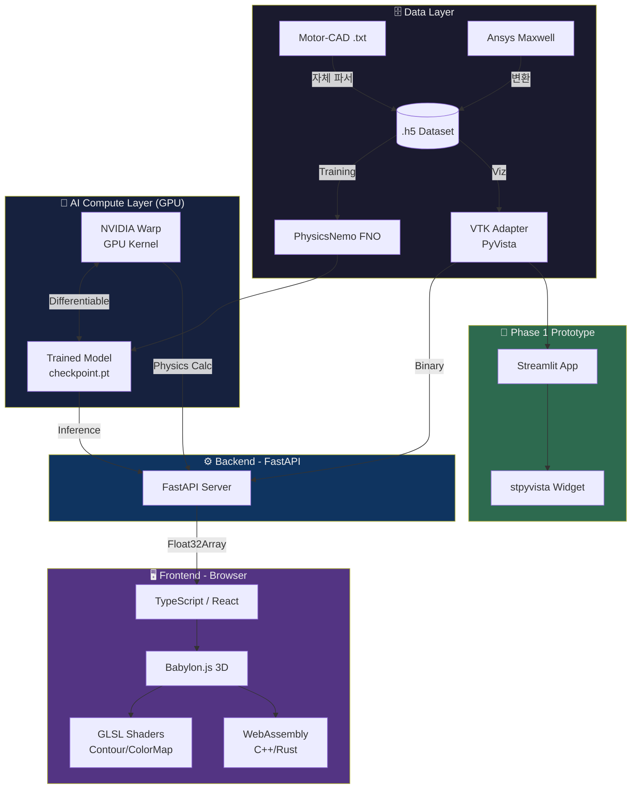
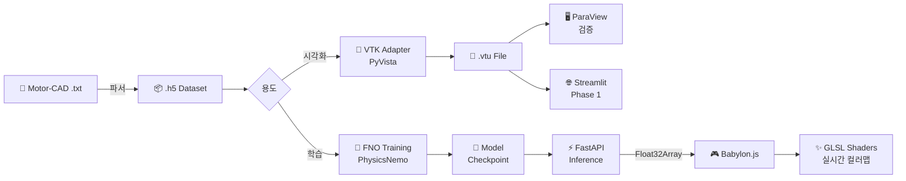
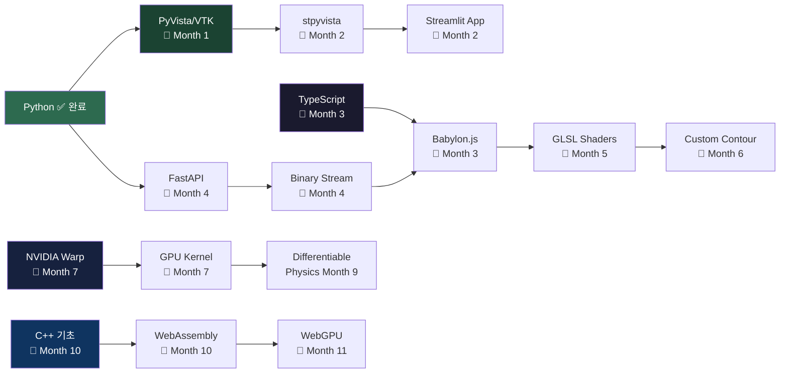
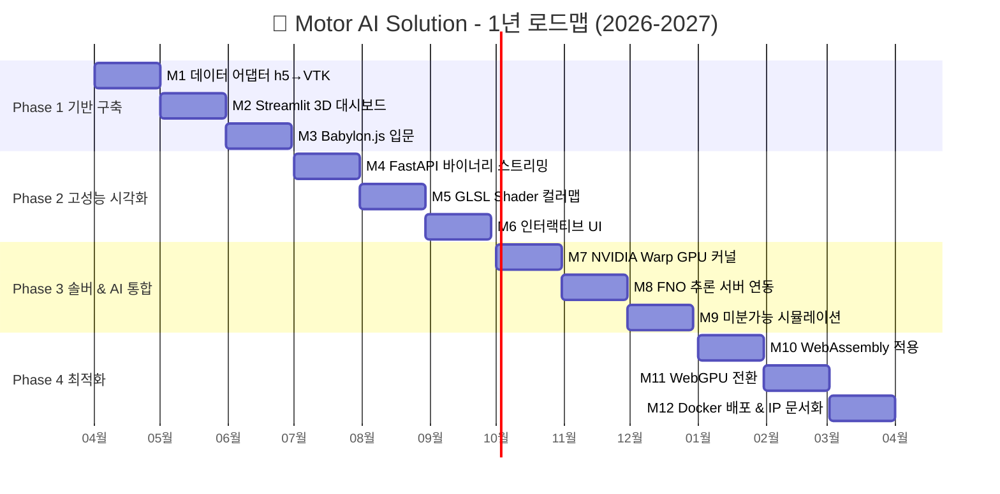

# 🏗️ Motor AI Solution - 기술 아키텍처

---

## 1. 전체 시스템 아키텍처



---

## 2. 데이터 파이프라인 플로우



---

## 3. 기술 학습 의존성 맵



---

## 4. 1년 개발 타임라인



---

## 5. 3계층 시스템 구조 요약

```
┌─────────────────────────────────────────┐
│  🧠 SERVER-SIDE (The Brain)             │
│  NVIDIA Warp + PhysicsNemo/FNO         │
│  PyTorch · Python · GPU 환경           │
├─────────────────────────────────────────┤
│  ⚙️  MIDDLEWARE (The Bridge)            │
│  FastAPI → Float32Array Binary Stream  │
├─────────────────────────────────────────┤
│  🖥️  CLIENT-SIDE (The Interface)        │
│  TypeScript → Babylon.js               │
│  GLSL Shaders (실시간 컬러맵)           │
│  WebAssembly (지오메트리 연산 가속)      │
└─────────────────────────────────────────┘
```
