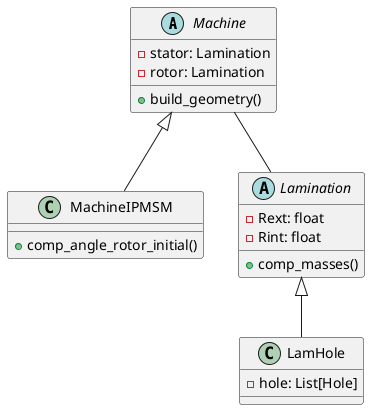
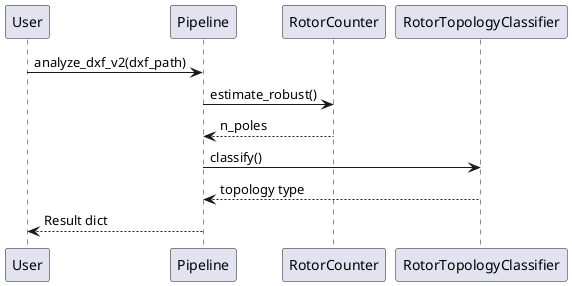
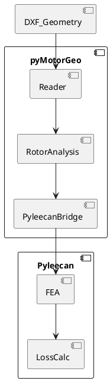
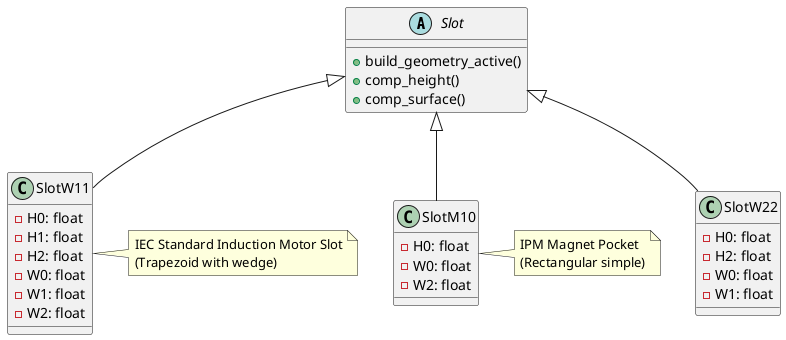
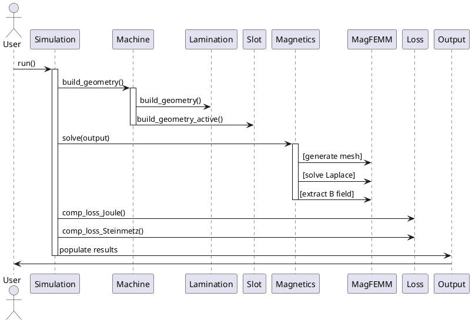
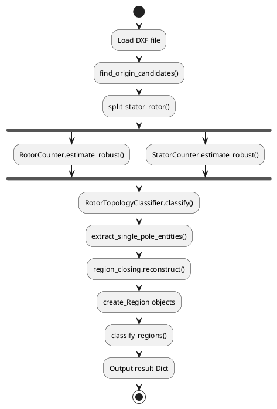

# UML Diagram Generation Guide - Summary & Next Steps

## Documents Created

I've generated **3 comprehensive analysis documents** in `/Plan/UML/`:

### 1. **CODEBASE_ARCHITECTURE_ANALYSIS.md** (12 sections, ~400 lines)
**What's Inside:**
- Complete Pyleecan class hierarchy (all 271 classes documented)
- All slot, machine, lamination types organized by category
- Material, simulation, output, loss model structures
- eMach pyMotorGeo module organization (32 Python modules)
- Data flow diagrams (input → processing → output pipelines)
- Comparison table: Pyleecan vs eMach workflows
- UML generation priorities organized by module

**Use For:** Understanding overall architecture, dependencies, and design patterns

---

### 2. **COMPLETE_CLASS_REFERENCE.md** (10 sections, ~300 lines)
**What's Inside:**
- All 271 Pyleecan classes listed alphabetically
- Classes organized by category:
  - Geometry primitives (Arc, Line, Circle, Surface)
  - Slot types (50+ types: W10-W30, M10-M63)
  - Machine types (MachineSync, MachineAsync, 12 variants)
  - Lamination types (LamSlot, LamHole, Cage variants)
  - Material, output, simulation classes
  - Loss models (Joule, Steinmetz, Windage, Magnet)
  - FEA solvers (FEMM, Elmer)
  - Optimization & design classes
  - Import/export & utility classes
- eMach pyMotorGeo modules (32 files) with brief descriptions
- eMach MATLAB legacy classes (@DataDqMap, @MotorcadData, etc.)
- Integration points (bridges to Pyleecan/MotorCAD)

**Use For:** Quick lookup of specific classes, hierarchies, and module names

---

### 3. **METHOD_SIGNATURES_AND_DATAFLOW.md** (12 sections, ~600 lines)
**What's Inside:**
- Key method signatures for Pyleecan:
  - `Machine.build_geometry()`, `comp_output_geo()`, etc.
  - `Lamination.comp_masses()`, `comp_volumes()`, etc.
  - `Slot` methods (all 50+ types)
  - `Winding.comp_connection_mat()`, `comp_winding_factor()`, etc.
  - `Simulation.run()`, `Magnetics.solve()`, etc.
  - `Loss` model methods
  - `Output` and result classes
- eMach pyMotorGeo method signatures:
  - `analyze_dxf_v2()` [main entry point]
  - `RotorCounter.estimate_robust()`
  - `StatorCounter.estimate_slots()`
  - `RotorTopologyClassifier.classify()`
  - Region/face detection algorithms
  - `create_machine_from_rotor_entities()` [bridge function]
  - Slot/hole conversion utilities
- Detailed algorithm descriptions
- Parameter types & return values
- Use case examples

**Use For:** Creating sequence diagrams, activity diagrams, and implementation details

---

## Quick Statistics

| Component | Count | Documented |
|-----------|-------|-----------|
| **Pyleecan Classes** | 271 | ✅ All |
| **Pyleecan Methods Directories** | 14 | ✅ All (200+ methods) |
| **Pyleecan Slot Types** | 50+ | ✅ All listed |
| **Pyleecan Machine Types** | 12 variants | ✅ All |
| **eMach Python Modules** | 32 | ✅ All |
| **Method Signatures Documented** | 150+ | ✅ All key methods |

---

## How to Use These Documents for PlantUML

### **For Class Diagrams** (ER/Domain Models)

**Step 1:** Reference `COMPLETE_CLASS_REFERENCE.md`
- Pick the class you need (e.g., "MachineIPMSM")
- Note the parent class (e.g., extends `MachineSync → Machine`)
- Note composition members (e.g., `rotor: LamHole`, `stator: LamSlotWind`)

**Step 2:** Reference `CODEBASE_ARCHITECTURE_ANALYSIS.md`, Section 2.15
- View class relationships table showing composition/inheritance
- Understand hierarchy depth (e.g., Slot → SlotW11 → specific parameterized slot)

**Step 3:** Generate PlantUML Class diagram


### **For Sequence Diagrams** (Workflows)

**Step 1:** Reference `METHOD_SIGNATURES_AND_DATAFLOW.md`, Section 1.5
- Find `Simulation.run()` method
- Review the process steps and dependencies

**Step 2:** Reference `CODEBASE_ARCHITECTURE_ANALYSIS.md`, Section 4.1
- Review data flow diagram (input → processing → output)
- Identify key method calls and their sequence

**Step 3:** Reference `METHOD_SIGNATURES_AND_DATAFLOW.md`, Section 2.3
- Find `analyze_dxf_v2()` execution flow (steps 1-11)
- Use the ordered process list as sequence

**Step 4:** Generate PlantUML Sequence diagram


### **For Component/Integration Diagrams**

**Step 1:** Reference `CODEBASE_ARCHITECTURE_ANALYSIS.md`, Section 11 (Integration Roadmap)
- View three integration options
- Option A: Pyleecan-first
- Option B: eMach CAD-first
- Option C: Hybrid workflow

**Step 2:** Reference `METHOD_SIGNATURES_AND_DATAFLOW.md`, Section 3.1
- Find bridge function signatures:
  - `create_machine_from_rotor_entities()`
  - `create_lamination_from_geometry()`
  - `create_hole_from_magnet_region()`
  - Understand conversion process flow

**Step 3:** Generate PlantUML Component diagram


### **For Deployment/Package Diagrams**

**Step 1:** Reference `COMPLETE_CLASS_REFERENCE.md`, Section 5+ (eMach structure)
- Review directory organization:
  - `Class/pyMotorGeo/` — 32 Python modules
  - `Class/@DataDqMap/`, `@MotorcadData/` — Data packages
  - `mlxperPJT/` — Jupyter workflows

**Step 2:** Reference `CODEBASE_ARCHITECTURE_ANALYSIS.md`, Section 5.1 (eMach Overview)
- View full directory tree
- Understand module dependencies

**Step 3:** Generate PlantUML Deployment diagram
```plantuml
@startuml
package eMach {
  package pyMotorGeo {
    module core
    module reader
    module analysis_rotor
    module analysis_stator
    module topology_rotor
    module pyleecan_bridge
    module pipeline
  }
  package Workflows {
    component [Jupyter Notebooks]
  }
}

package Pyleecan {
  module machine_classes
  module simulation
  module fea_solvers
}

package External {
  component [MotorCAD]
  component [FEMM]
  component [Elmer]
}

@enduml
```

---

## Specific PlantUML Tips

### Class Diagram Example: Pyleecan Slot Hierarchy


### Sequence Diagram Example: Pyleecan Simulation


### eMach DXF Analysis Flow


---

## Key Drawings to Create (Recommended Priority)

### High Priority (Core Understanding)
1. **Pyleecan Machine Hierarchy**
   - File: `COMPLETE_CLASS_REFERENCE.md` + `CODEBASE_ARCHITECTURE_ANALYSIS.md` §2.15
   - Type: Class Diagram
   - Classes: Machine, MachineAsync, MachineSync, IPMSM, SyRM, etc.

2. **Pyleecan Lamination & Slot Hierarchy**
   - File: `COMPLETE_CLASS_REFERENCE.md` + `CODEBASE_ARCHITECTURE_ANALYSIS.md` §2.2-2.3
   - Type: Class Diagram
   - Classes: Lamination, LamSlot, LamHole, Slot, SlotW*, SlotM*

3. **eMach pyMotorGeo Pipeline**
   - File: `METHOD_SIGNATURES_AND_DATAFLOW.md` §2.3 + `CODEBASE_ARCHITECTURE_ANALYSIS.md` §5.6
   - Type: Sequence Diagram + Activity Diagram
   - Flow: DXF → Reader → Analysis → Topology → Bridge → Pyleecan

4. **Pyleecan Simulation Workflow**
   - File: `METHOD_SIGNATURES_AND_DATAFLOW.md` §1.5-1.7 + `CODEBASE_ARCHITECTURE_ANALYSIS.md` §4.1
   - Type: Sequence Diagram
   - Flow: Simulation.run() → Magnetics.solve() → Loss calculation → Output

### Medium Priority (Detailed Logic)
5. **eMach Region Detection & Classification**
   - Type: Sequence Diagram
   - Classes: region_closing.py, regions.py, topology_rotor.py

6. **Material & Output Results Structure**
   - Type: Class Diagram
   - Classes: Material, OutGeo, OutMag, OutElec, OutLoss

7. **Integration: eMach → Pyleecan Bridge**
   - Type: Component Diagram + Sequence Diagram
   - Flow: DXF geometry → Lamination/Slot/Hole creation → Machine

### Lower Priority (Specialized)
8. **Optimization Loop (OptiProblem)**
   - Type: Activity Diagram
   - Classes: OptiProblem, OptiDesignVar, OptiConstraint, OptiSolver

9. **Loss Calculation Models**
   - Type: Class Diagram
   - Classes: LossModel*, EKC (Joule, Steinmetz, Windage, etc.)

10. **FEA Mesh & Solver Interface**
    - Type: Component Diagram
    - Classes: Mesh*, RefElement*, Magnetics (FEMM, Elmer)

---

## Next Steps

1. **Choose a Drawing Type:** Start with Class Diagrams (easiest, foundational)
2. **Pick a Subsystem:** Start with Pyleecan Machine Hierarchy (simplest, most self-contained)
3. **Gather Info:** Copy from `COMPLETE_CLASS_REFERENCE.md` + `CODEBASE_ARCHITECTURE_ANALYSIS.md`
4. **Write PlantUML:** Use syntax examples above
5. **Validate:** Check composition/inheritance against real code in Classes/ directory
6. **Expand:** Add more classes/methods, add notes, add stereotypes

---

## Document Cross-References

When creating PlantUML diagrams, cross-reference these sections:

| Diagram Type | Reference File | Section |
|--------------|----------------|---------|
| **Class Hierarchy** | COMPLETE_CLASS_REFERENCE.md | Categories 1-14 |
| **Composition** | CODEBASE_ARCHITECTURE_ANALYSIS.md | §2.15 (Relationships) |
| **Sequence Flow** | METHOD_SIGNATURES_AND_DATAFLOW.md | §1, §2.3, §3.1 |
| **Data Objects** | CODEBASE_ARCHITECTURE_ANALYSIS.md | §3-8 |
| **Method Details** | METHOD_SIGNATURES_AND_DATAFLOW.md | All sections |
| **Integration** | CODEBASE_ARCHITECTURE_ANALYSIS.md | §6, §9, §11 |
| **Examples** | All documents | Sections marked "Example" or "Use Case" |

---

## File Locations

All analysis documents are saved in:
```
d:\KangDH\Emlab_emach\Plan\UML\
  ├── CODEBASE_ARCHITECTURE_ANALYSIS.md
  ├── COMPLETE_CLASS_REFERENCE.md
  ├── METHOD_SIGNATURES_AND_DATAFLOW.md
  └── [This guide]
```

---

## Contact & Questions

If you need:
- ✅ **More details on a specific class**: Check COMPLETE_CLASS_REFERENCE.md
- ✅ **Method signatures & parameters**: Check METHOD_SIGNATURES_AND_DATAFLOW.md
- ✅ **Data flow & workflow**: Check CODEBASE_ARCHITECTURE_ANALYSIS.md §4-5
- ✅ **Code sample to verify structure**: Look at actual files in:
  - `d:\gitfolder\pyleecan\Classes\*.py` (class definitions)
  - `d:\gitfolder\pyleecan\Methods\*\*.py` (method implementations)
  - `d:\KangDH\Emlab_emach\Class\pyMotorGeo\*.py` (eMach modules)

---

**Last Updated:** 2026-04-01  
**Analysis Complete:** ✅ All 271 Pyleecan + 32 eMach modules documented
