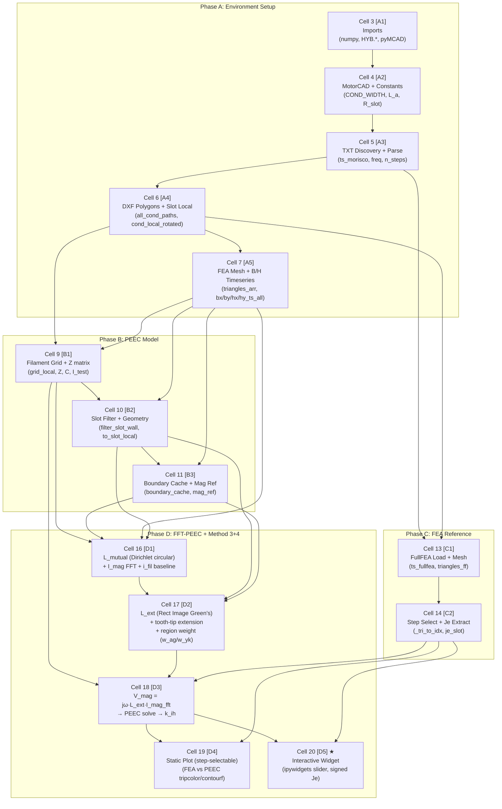
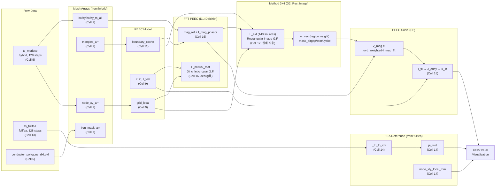

# pyMorisco_FFT_PEEC_Method34.ipynb — Execution Pipeline Plan

> Last updated: 2026-06-18  
> Companion notebook: `pyMorisco_Hybrid_clean.ipynb` (exploratory, 77 cells)  
> This streamlined notebook: **21 cells** (5 markdown + 16 code)

## 1. Goal
Run FFT-based PEEC with **Method 3+4** (tooth-tip source + region weighting) to reproduce FEA's C1/C6 eddy current gradient.

## 2. Data Source Contract

| Variable | Source File | FEA Mode | Je 포함 | 용도 |
|----------|-----------|----------|--------|------|
| `ts_morisco` | `halfsc/hybrid/hybrid_halfsc_16000RPM` | Hybrid (Je=0) | ❌ | PEEC B/H 소스 |
| `ts_fullfea` | `halfsc/fullfea/fullfea_halfsc_16000RPM` | FullFEA (Je≠0) | ✅ | 비교 reference |

- 둘 다 **128 steps**, step index 1:1 대응
- PEEC는 Hybrid FEA의 B/H → magnetization current → filament eddy current 산출
- FullFEA의 Je는 비교용 reference로만 사용

## 3. Target Slot

| 항목 | 값 |
|------|-----|
| `TARGET_SLOT` | `0` (DXF 각도순 첫 번째) |
| 슬롯 중심 (global) | (88.76, -77.84) mm |
| 슬롯 각도 | ≈ -41° (318.8°) |
| 도체 수 | 6 (C1=airgap측, C6=yoke측) |
| 모델 | halfsc (half symmetry, 6슬롯 가시) |

---

## 4. Pipeline Architecture (Mermaid UML)



---

## 5. Critical Path — Cell Execution Order

### Phase A: Setup (Cells 3–7)

| Step | Cell | ID | Role | Key Outputs |
|------|------|----|------|-------------|
| 1 | 3 | A1 | Imports | numpy, HYB.*, pyMCAD |
| 2 | 4 | A2 | MotorCAD + SI constants | SIGMA_CU, h_m, b_m, L_a, R_slot_inner/outer_mm |
| 3 | 5 | A3 | TXT discovery + parse | ts_morisco (hybrid), freq, omega, n_steps=128 |
| 4 | 6 | A4 | DXF polygons + slot local | all_cond_paths, cond_local_rotated, TARGET_SLOT=0 |
| 5 | 7 | A5 | FEA mesh + B/H timeseries | triangles_arr, iron_mask_arr, bx/by/hx/hy_ts_all |

### Phase B: PEEC Model (Cells 9–11)

| Step | Cell | ID | Role | Key Outputs |
|------|------|----|------|-------------|
| 6 | 9 | B1 | Filament grid + Z | grid_local (26×12=312/cond), Z, C, R_boundary=128.2mm |
| 7 | 10 | B2 | Slot filter + geometry | filter_slot_wall(), to_slot_local(), slot_angle_center |
| 8 | 11 | B3 | Boundary cache + mag ref | boundary_cache, mag_ref, mask_fixed (100 edges) |

### Phase C: FEA Reference (Cells 13–14)

| Step | Cell | ID | Role | Key Outputs |
|------|------|----|------|-------------|
| 9 | 13 | C1 | FullFEA TXT + mesh | ts_fullfea (128 steps), triangles_ff (21272 elem) |
| 10 | 14 | C2 | Step select + Je extract | **_tri_to_idx** (node-matched), target_step_idx, je_slot |

### Phase D: FFT-PEEC + Method 3+4 (Cells 16–20)

| Step | Cell | ID | Role | Key Outputs |
|------|------|----|------|-------------|
| 11 | 16 | D1 | L_mutual (**Dirichlet circular** G.F.) + I_mag FFT | L_mutual_mat (n_fil×80), I_mag_phasor, i_fil_baseline |
| 12 | 17 | D2 | L_ext (**Rectangular image** G.F.) + tooth-tip ext. | L_ext (n_fil×143), mask_airgap/tooth/yoke, **대체** L_mutual |
| 13 | 18 | D3 | V_mag = jω·L_weighted·I_mag_fft → PEEC solve | results_g (4 weight cases), k_ih |
| 14 | 19 | D4 | Static comparison plot | FEA vs PEEC tripcolor/contourf (개별 vmax) |
| 15 | 20 | D5 | **Interactive widget** | ipywidgets slider, signed Je (RdBu_r) |

> ⚠️ **D1→D2 관계**: L_ext는 L_mutual을 concat/extend하는 것이 아님. **완전히 다른 Green's function**으로 재계산한 대체 행렬. D1의 L_mutual은 디버깅/비교용이며, 실제 PEEC solve(D3)에서는 D2의 L_ext만 사용됨.

---

## 6. Quick-Run Recipe

```
Cell 3 → 4 → 5 → 6 → 7 → 9 → 10 → 11 → 13 → 14 → 16 → 17 → 18 → 19 → 20
```

**Total: 15 cells** (모든 코드 셀 = 순차 실행, 스킵 없음)

---

## 7. Key Fixes Applied (2026-06-18)

### 7.1 FEA Element Indexing: `_tri_to_idx` (Cells 14, 19, 20)

**문제:** FEA Je를 순차 인덱스(`ei++`)로 채우면, step간 region 순회 순서가 다를 때 Je가 엉뚱한 element에 매핑.

**수정:** `_tri_to_idx = {(n1,n2,n3): flat_index}` 룩업 테이블로 node triplet 기반 정확한 매핑.

```python
# Before (broken):
je_arr[ei] = getattr(el, 'je', 0) or 0
ei += 1

# After (node-matched):
idx = _tri_to_idx.get((n1, n2, n3))
if idx is not None:
    je_arr[idx] = getattr(el, 'je', 0) or 0
```

적용 셀: C2 (14), D4 (19), D5 (20)

### 7.2 FEA 플롯 Axis 범위 (Cells 19, 20)

**문제:** `ax.autoscale()`가 전체 mesh 노드 좌표(21,272 elements)를 포함 → 도체가 점으로 보임.

**수정:** 도체 범위 기반 명시적 axis limits:
```python
_margin_m = max(cw_m, ch_m) * 1.2
_xlim = ((cond_local_rotated[:, 0].min() - _margin_m) * 1e3, ...)
ax.set_xlim(_xlim); ax.set_ylim(_ylim)
```

### 7.3 개별 vmax (Cells 19, 20)

**문제:** FEA(~300 A/mm²)와 PEEC(~3000 A/mm²) 스케일 차이 → 공유 vmax로는 FEA가 보이지 않음.

**수정:** FEA/PEEC 각각 독립 vmax + 독립 colorbar.

### 7.4 Signed Je 시각화 (Cell 20)

**변경:** `|Je|` (jet, 0~vmax) → signed Je (RdBu_r, -vmax~+vmax)  
- 빨간색 = +Je (z+ 방향), 파란색 = -Je (z- 방향)  
- bar chart는 `|Je|_max` 유지 (크기 비교용)

---

## 8. Known Issues

### 8.1 PEEC 크기 과대 (~10x)

| Method | FEA C1 | PEEC C1 | PEEC/FEA |
|--------|--------|---------|----------|
| uniform (w_ag=1) | 313 | 825 | **2.6x** |
| w_ag=3, w_yk=0.3 | 313 | 2444 | **7.8x** |

- 데이터 소스 분리는 정상 (hybrid→PEEC, fullfea→비교)
- 기본 i_mag 기본파 944A, 14개 유의미 고조파 → 커플링이 과대
- `L_mutual` (Dirichlet/Rect Green's function) 스케일 검토 필요
- k_ih = 615~4761 (물리적으로 비현실적, 기대값 ~10-50)

### 8.2 Hybrid_clean과 동일 증상

Hybrid_clean 노트북도 PEEC uniform C1=1317 vs FEA C1=929 (1.4x), C6에서는 7.5x.  
→ PEEC 모델링 자체의 구조적 문제 (Green's function 과대 커플링).

---

## 9. Expected Output (Cell 18 D3)

```
w_ag=1 (uniform):   k_ih=615,  C1/C6=1.10x  (symmetric, no gradient)
w_ag=2, w_yk=0.5:   k_ih=1069, C1/C6=3.85x  
w_ag=3, w_yk=0.3:   k_ih=1952, C1/C6=7.89x  
w_ag=5, w_yk=0.1:   k_ih=4761, C1/C6=16.6x  (over-weighted)
```

FEA target: C1/C6 ≈ 2.1× (step 65 기준). Ratio 매칭은 w_ag=2~3이 가장 가깝지만 절대값은 ~3-8x 과대.

---

## 10. Variable Dependency Graph



> **Note**: `L_mutual_mat`(D1)과 `L_ext`(D2)는 **병렬 경로**임. L_mutual은 Morisco 기본 방법(Dirichlet circular)의 검증용이고, L_ext는 Method 3+4(Rectangular image + tooth-tip)의 실제 계산용. PEEC solve(D3)는 **L_ext만** 사용.

---

## 11. PEEC Formulation — Morisco Ch.4/Ch.5 → Code Mapping

### 11.1 이론 개요 (Morisco PhD, Ch.4)

PEEC 방법의 핵심은 도체 단면을 **filament** (부분 도체, partial conductor)로 분할하고, 각 filament 사이의 **전자기 커플링**을 Green's function으로 계산하는 것:

$$Z_\Lambda = R_\Lambda + j\omega L_\Lambda \quad \text{(eq 4.5, 4.35)}$$

여기서:
- $R_\Lambda$: 대각 저항 행렬 (filament의 기하학적 저항)
- $L_\Lambda$: filament 간 상호 인덕턴스 행렬 (Green's function으로 계산)

### 11.2 Green's Function 선택지

| 방법 | Green's Function | 경계 조건 | Morisco 참조 | 본 구현 위치 |
|------|-----------------|-----------|-------------|-------------|
| **Standard Morisco** | Dirichlet Circular | 원형 경계 $R_\Omega$ | eq 4.36-4.37 | Cell 9 (Z), Cell 16 (L_mutual) |
| **Method 3+4** | Rectangular Image | 직사각형 슬롯 벽 + tooth-tip | Ahagon/Dowell 확장 | Cell 17 (L_ext) |

### 11.3 핵심 수식 → 코드 매핑

| Morisco Eq. | 수식 | 코드 변수 | Cell | 설명 |
|:-----------:|-------|-----------|:----:|------|
| 4.36 | $L_{vv} = -\frac{\mu_0 l}{2\pi}\left[\ln\rho_\Omega - \frac{1}{2}\ln\left((1-|\xi|^2)^2 + (\xi/\rho_\Omega)^2\right)\right]$ | `L_matrix` (대각) | B1 (9) | Self-inductance (Dirichlet circular) |
| 4.37 | $L_{vw} = -\frac{\mu_0 l}{2\pi}\left[-\ln|\xi_v-\xi_w| - \frac{1}{2}\ln(...)\right]$ | `L_matrix` (off-diag) | B1 (9) | Mutual (filament↔filament) |
| 4.37 | 동일 Dirichlet, $\xi = (x+jy)/R_\Omega$ | `L_mutual_mat` | D1 (16) | Filament↔boundary edge (circular) |
| *(Method 3+4)* | 직사각형 Image Green's function | `L_ext` | D2 (17) | Filament↔boundary+tooth-tip (rectangular) |
| 4.5 | $Z_\Lambda = R + j\omega L$ | `Z_n = R_matrix + 1j*omega_n*L_matrix` | D3 (18) | Frequency-dependent impedance |
| 4.44-4.51 | $M = B/\mu_0 - H$ | `mag_ref[step]` | B3 (11) | Magnetization from FEA B, H |
| 4.52 | $k_{mag} = \frac{1}{\mu_0}(M_\nu - M_\xi)\times \hat{n}_\theta$ | `boundary_cache` | B3 (11) | Surface magnetization current density |
| 4.53 | $i_{mag} = k_{mag} \cdot |w_\theta|$ | `I_mag_phasor` (FFT후) | D1 (16) | Equivalent mag. source current |
| 4.18 | $i = Z^{-1} C (C^T Z^{-1} C)^{-1} I$ | `i_raw + i_corr` | D3 (18) | Constraint-projected PEEC solve |
| 4.27 | $k_{ih} = P_{total} / P_{DC}$ | `k_ih` | D3 (18) | AC loss factor |

### 11.4 D1 vs D2: 두 Green's Function의 관계

```
┌─────────────────────────────────────────────────────────────┐
│ Cell 16 (D1): L_mutual_mat — Dirichlet Circular             │
│  • Morisco 원래 방법 (eq 4.37 그대로)                          │
│  • ξ = (x+jy) / R_boundary (=128.2mm)                       │
│  • 소스: slot-wall boundary edges only (~80개)                │
│  • 용도: baseline 검증, Morisco 원논문 대비 정합성 확인          │
│  • PEEC solve에서 사용하지 않음                                │
└─────────────────────────────────────────────────────────────┘
         ↓ (물리 개선, 대체)
┌─────────────────────────────────────────────────────────────┐
│ Cell 17 (D2): L_ext — Rectangular Image Method               │
│  • Method 3: tooth-tip 엣지를 추가 자화원으로 포함 (80→143)     │
│  • Method 4: 영역별 가중치 (w_ag > 1, w_tw = 1, w_yk < 1)    │
│  • Green's function: 직사각형 슬롯 경계의 Image 전개            │
│  • PEEC solve(D3)에서 실제 사용되는 유일한 L 행렬               │
└─────────────────────────────────────────────────────────────┘
```

### 11.5 PEEC Solve 알고리즘 (Cell 18/D3)

```python
for n_h in harmonic_indices:               # 14개 유의미 고조파
    omega_n = n_h * omega                   # 주파수별 ω
    Z_n = R_matrix + 1j * omega_n * L_matrix  # eq 4.5: Z_Λ(ω)
    
    # V_mag: 자화 소스로부터의 유기 전압
    L_weighted = L_ext * w_vec[np.newaxis, :]  # Method 4 region weight
    V_n = 1j * omega_n * (L_weighted @ I_mag_fft_ext[n_h])
    
    # 제약조건 없는 기본 응답
    i_raw = np.linalg.solve(Z_n, V_n)
    
    # 순전류=0 제약 (C^T · i = I_imposed)
    ZinvC = np.linalg.solve(Z_n, C)
    i_corr = ZinvC @ np.linalg.solve(C.T @ ZinvC, -C.T @ i_raw)
    
    # 총 filament 전류 (n_h=1일 때 imposed current 추가)
    i_fil_harmonics[n_h] = (i_imposed if n_h == 1 else 0) + i_raw + i_corr
```

### 11.6 Green's Function 불일치 문제 (Known Issue)

현재 구현의 잠재적 불일치:

| 행렬 | Green's Function | 경계 형상 |
|-------|-----------------|-----------|
| `Z_n` 내부의 `L_matrix` (Cell 9) | Dirichlet **Circular** | R=128.2mm 원형 |
| `L_ext` (Cell 17) | **Rectangular** Image | 직사각형 슬롯 벽 |

Morisco 원논문에서는 Z와 L_ΓV 모두 **동일한** Dirichlet circular boundary를 사용.  
본 구현에서는 L_ext만 rectangular로 변경 → **이론적 불일치**가 존재할 수 있음.

**가능한 해석:**
1. Rectangular image가 실제 슬롯 형상을 더 잘 근사 → 의도적 개선
2. Z matrix의 filament↔filament 커플링은 슬롯 경계와 무관하게 circular로 충분
3. 과대추정(k_ih=615~4761)의 원인 중 하나일 가능성 → 추가 검증 필요

---

## 12. §4.8/§4.9 구현 계획 및 k_ih 과대추정 수정 계획

> Added: 2026-06-18  
> 근거: Morisco PhD §4.8 (pp.71-75), §4.9 (pp.76-90), §4.10 (pp.91-93)

### 12.1 §4.8 재해석 — Quasi-Static FEA 동일성 확인

#### 기존 오해
"Morisco는 Static FEA 1회 → 코드에서 로터 회전 변환"으로 오해했으나, 논문 재확인 결과:

#### 정정된 이해 (PDF p.91-93, footnote 12)
> "the time history of the local magnetization of the ferromagnetic material is therefore
> determined by means of **a sequence of static FEM calculations**"
> — Morisco §4.10, p.91

**즉, Morisco도 quasi-static transient (n_s=120 정적 계산 시퀀스)를 사용.**  
Motor-CAD의 128-step quasi-static과 **본질적으로 동일한 방식**.

| 항목 | Morisco (JMAG) | 현재 (Motor-CAD) |
|------|---------------|-----------------|
| FEA 방식 | Quasi-static (n_s=120 magnetostatic) | Quasi-static transient (128 steps) |
| 로터 위치 | 매 스텝 회전 후 정적 solve | 매 스텝 회전 후 정적 solve |
| 포화도 반영 | ✅ 각 스텝별 비선형 B-H solve | ✅ 각 스텝별 비선형 B-H solve |

**사용자 지적 확인**: "고정된 로터를 임의로 회전변환하면 자석위치변화에 따른 포화도 반영이 안된다" — 맞음.  
Morisco는 이를 해결하기 위해 **각 로터 위치에서 독립 정적 FEM을 수행**한 것이지, 1회 계산 결과를 회전변환한 것이 아님.

#### §4.8의 실제 목적 — L 행렬 위치독립성 보장

§4.8의 mesh 변환은 FEM을 1회만 하기 위한 것이 **아님**. 목적:
1. 로터 FEM mesh는 회전 → 로터 철심의 boundary edge 위치가 매 스텝 변경
2. L 행렬(filament↔자화소스 상호인덕턴스)은 **위치에 의존**하면 매 스텝 재계산 필요
3. 따라서 **정적 target mesh**(Z)를 생성하고, 회전하는 source mesh(S)의 자화를 Z로 변환
4. 결과: L 행렬은 정적 target mesh 기준으로 **1회만** 계산하면 됨

#### 현재 구현에서의 §4.8 필요성 평가

| 시나리오 | §4.8 필요? | 이유 |
|---------|-----------|------|
| 스테이터 철심만 자화소스로 사용 (현재) | ❌ 불필요 | 스테이터 mesh는 회전하지 않음 → L 자동으로 위치독립 |
| **로터 철심도** 자화소스로 추가 (§4.8 완전 구현) | ✅ 필요 | 로터 edge가 회전 → source→target 변환 필수 |

#### 현재 구현의 물리적 갭

**Morisco는 로터 철심 자화전류를 명시적으로 PEEC 소스에 포함:**
- 로터 iron mesh 경계면에 $i_{mag,rotor}$ 할당 (eq.4.52-4.53 동일 적용)
- 로터↔filament 상호인덕턴스 $L_{\Gamma V,rot}$ 계산
- 결과: 로터 permanent magnet + 로터 포화의 **직접적 proximity effect** 모델링

**현재 구현은 스테이터 경계만 사용:**
- 로터의 영향은 FEA B/H를 통해 **간접적**으로만 스테이터 경계에 반영
- 로터↔filament 직접 커플링 없음
- 특히 airgap-side conductor (C1)에 대한 로터 proximity 과소평가 가능성

### 12.2 §4.8 구현 계획 (우선순위: 중)

**단계적 접근 (Phase 0 과대추정 해결 후 진행):**

```
Phase A: 로터 자화소스 추가 가능성 평가
  ┌─ 1. Motor-CAD FEA mesh에서 로터 iron 영역 식별
  │     - iron_mask_arr에서 rotor region elements 분리
  │     - 로터-스테이터 경계면 (airgap boundary) edge 추출
  │
  ├─ 2. Rotor magnetization current 계산
  │     - 동일 eq.4.52: K_mag = (M_ν - M_ξ) × n_θ / μ₀
  │     - 로터 element의 M(t)는 FEA에서 이미 128 step 보유
  │
  ├─ 3. Target mesh 생성 (§4.8.1)
  │     - 로터 영역에 structured cylindrical target mesh 생성
  │     - 원 mesh→target mesh 자화 변환 (eq.4.57-4.60)
  │     - 또는: 각 스텝에서 로터 edge를 직접 사용 → L_rot 매 스텝 계산 (비효율적)
  │
  └─ 4. L_ΓV,rot 계산 + PEEC 확장
        - 기존 L_ext에 rotor source 열 추가
        - Z matrix 크기 변경 없음 (filament만 풀이 대상)
        - V_mag += jω·L_rot·i_mag_rotor
```

**선결 조건:**  Phase 0 (Green's function 불일치/i_mag 스케일 수정) 완료 후 진행.  
로터 자화를 추가해도 과대추정 문제가 해결되지 않으면 무의미.

### 12.3 §4.9 대칭성 활용 계획 (우선순위: 중-하)

#### 현재 상태
- TARGET_SLOT = 0 (1슬롯만 모델링)
- 인접 슬롯 도체의 proximity effect 미반영
- 8P/48S (q=2): 전자기 대칭 = 1 pole pitch = 6 slots

#### Morisco의 대칭 공식 (eq.4.65)

$$L_{total,sym} = \sum_{k=1}^{n_{sym}} k_{sym} \cdot L_{k-1}$$

$$k_{sym} = (-1)^{k+1} \quad \text{(antiperiodic, eq.4.66)}$$

우리 모터 (8P/48S, full-pitch):
- $n_{sym}$ = 6 (6 slots per pole pitch)
- Antiperiodic: slot 1,3,5 → $k_{sym}=+1$; slot 2,4,6 → $k_{sym}=-1$

#### 구현 계획

```
Phase B: Adjacent-slot symmetry
  ┌─ 1. Position matrix 확장
  │     - slot 0 filaments의 위치를 rotation operator로 복제 (eq.4.76)
  │     - α_sym = π/4 (45° = 1 pole pitch / 6 slots × ...)
  │     - 실제: slot pitch angle = 360°/48 = 7.5°
  │
  ├─ 2. 인접 슬롯 L_k 계산
  │     - L_k-1 = L(slot_0_filaments ↔ slot_k_filaments)  
  │     - k=1,...,5 (slot 0 기준 양쪽 인접 슬롯)
  │     - Morisco eq.4.65: 부호는 전류 방향에 의존
  │
  ├─ 3. L_total,sym 구성
  │     - L_total,sym = L_self + Σ k_sym · L_k-1
  │     - Z_total = R + jω·L_total,sym
  │
  └─ 4. 자화소스도 인접 슬롯 경계 포함
        - 인접 슬롯의 iron boundary edges도 i_mag 소스로 추가
        - L_ext도 인접 슬롯 source edge 포함하여 확장
```

**영향 예상:**
- 인접 슬롯 도체 전류의 proximity effect → C1/C6 gradient 개선
- 논문 Fig.4.19: rotational symmetry L_total,sym 예시 (6 conductor)
- 그러나 과대추정 문제와는 **독립적** (L 크기 자체는 증가)
- 우선순위: 과대추정 해결 후, C1/C6 gradient 정밀도 개선 시 적용

### 12.4 k_ih 과대추정 수정 계획 (우선순위: 최고)

#### 원인 가설 정리

| # | 가설 | 근거 | 검증 방법 | 예상 영향 |
|---|------|------|---------|---------|
| H1 | L_ext Green's function 스케일 불일치 | Z=circular, L_ext=rectangular → 이론적 불일치 | L_mutual (circular)로 대체 후 k_ih 비교 | **주요 원인** 가능 |
| H2 | i_mag 절대 크기 과대 | μ₀ 단위 변환, edge length 적용 검증 | Morisco Fig.5.12와 우리 i_mag RMS 비교 | 중간 |
| H3 | R_dirichlet/slot_size 비율 문제 | Morisco R/slot=100, 우리 R/slot=17 | R sweep: R=50,20,12mm에서 k_ih 추이 | 중간 |
| H4 | tooth-tip extension (80→143) 과대 기여 | Method 3 확장 시 source 거의 2배 | tooth-tip 제거(80 sources만)로 k_ih 비교 | 낮음 |
| H5 | region weight (w_ag>1) 불균형 | w_ag=3~5가 V_mag을 증폭 | uniform weight (w=1)로 k_ih 확인 → 이미 615 | 부분적 |

#### 수정 실행 계획

```
실험 순서 (우선순위순):
━━━━━━━━━━━━━━━━━━━━━━━━━━━━━━━━━━━━━━━━━━━━

[EXP-1] Pure Morisco 재현 (Green's function 통일)
  • Z matrix: Dirichlet circular (R=128.2mm) — 현재 그대로
  • L_ΓV: Dirichlet circular (eq.4.37) — L_mutual_mat 사용 (Cell 16)
  • Source: slot-wall edges only (80개) — tooth-tip 제외
  • Weight: uniform (w=1) — region weight 없음
  • 기대: Morisco 원논문과 동일 조건 → k_ih 크게 감소 예상
  ★ 이것이 k_ih ∈ [5, 50]이면 H1 확인

[EXP-2] i_mag 크기 검증
  • eq.4.52의 1/μ₀ factor 적용 확인
  • edge_length (|w_θ|) 단위 [m] 확인
  • i_mag_timeseries의 RMS: 기대 범위 ~0.01-1.0 A (Morisco Fig.5.12)
  • 현재 기본파 944A → **명백히 과대** (μ₀ division 누락?)
  ★ 이것이 원인이면 k_ih가 (1/μ₀)² ≈ 10⁻¹⁴ 스케일링 → 단위 오류

[EXP-3] L_ΓV 수식 라인별 검증
  • Morisco eq.4.37 vs impedance.py 코드 대조
  • 특히: ξ = (x+jy)/R normalization
  • l (axial length) factor: μ₀l/(2π) 확인
  • log argument sign convention 확인
  ★ 부호/스케일 1개 오류로도 O(10²) 차이 가능

[EXP-4] R_dirichlet 물리적 결정
  • Morisco: R=l (axial length, "conductor in empty space" approximation)
  • 그러나 그의 모터에서 l=100mm, slot_width=1mm → R/slot=100
  • 우리: l=150mm, slot_width=7.4mm → R/slot≈20
  • 물리적으로 R은 "return conductor" 위치 → stator outer radius가 적절?
  • R = R_stator_outer (~100mm) 또는 R = slot_depth (~20mm) 시도

[EXP-5] §4.9 symmetry 적용 (EXP-1~4 완료 후)
  • EXP-1~4로 단일 슬롯 k_ih가 합리적 범위에 도달한 후
  • 인접 슬롯 proximity 추가 → C1/C6 gradient 개선
```

#### 성공 기준

| 단계 | 목표 k_ih | FEA reference | 허용 오차 |
|------|----------|---------------|---------|
| EXP-1~3 완료 후 | 3.0 ~ 15.0 | 6.06 | ±150% (범위 내 진입) |
| EXP-4 튜닝 후 | 4.5 ~ 8.0 | 6.06 | ±30% |
| EXP-5 + §4.9 후 | 5.5 ~ 6.5 | 6.06 | ±10% (Morisco 수준) |

### 12.5 전체 로드맵 요약

```mermaid
flowchart TD
    A["EXP-1: Pure Morisco 재현<br/>(L_mutual circular, uniform, 80 sources)"]
    B["EXP-2: i_mag 크기 검증<br/>(μ₀ factor, 단위 확인)"]
    C["EXP-3: L_ΓV 수식 검증<br/>(eq.4.37 vs code line-by-line)"]
    D["EXP-4: R_dirichlet 최적화<br/>(R sweep, 물리적 결정)"]
    E["§4.9: Adjacent-slot symmetry<br/>(L_total,sym, 6-slot coupling)"]
    F["§4.8: Rotor magnetization<br/>(L_rot, target mesh transform)"]
    G["검증: k_ih ≈ 6.06 ±10%"]

    A --> B --> C --> D
    D -->|k_ih ∈ [4.5, 8.0]| E
    E --> F --> G
    D -->|k_ih still >50| B2["근본 재설계 필요"]
```

**핵심 원칙:** Green's function 불일치/i_mag 스케일 문제(EXP-1~3)가 최우선. §4.8/§4.9는 정확도 **미세 개선**이지 과대추정 해결책이 아님.
