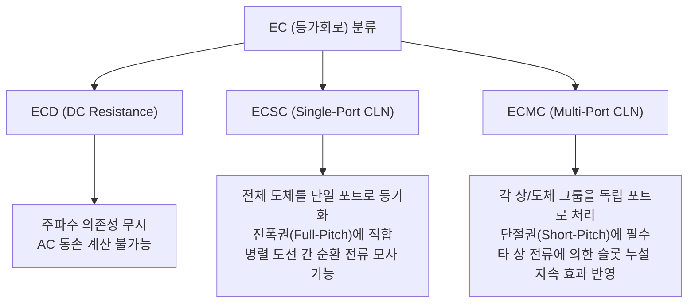
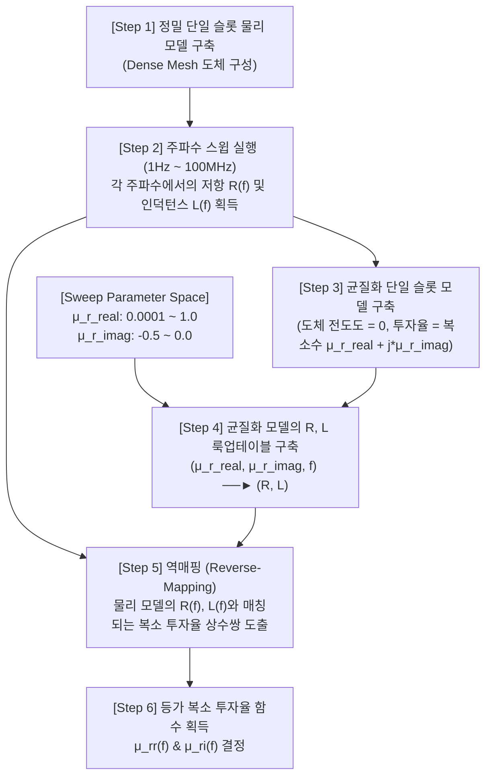
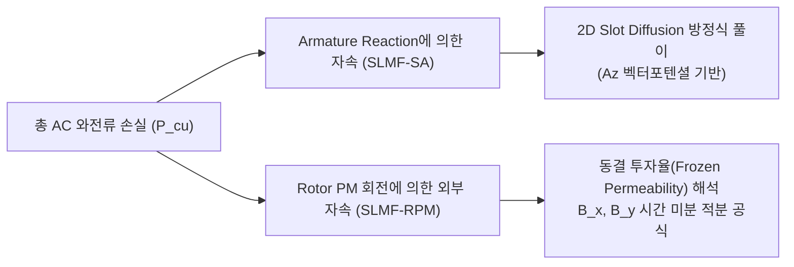

# AC Loss Correction Paper Analysis: JMAG (2025) vs. Sazhu (2026) vs. Ju (2023)

본 문서는 고속 EV 구동용 PMSM의 AC 동손(Winding Loss) 보정 및 모델링과 관련한 최신 연구 논문 3편을 분석하고, EveryMotor 프로젝트에 적용 가능한 물리적 모델링 관점을 정리합니다.

* **대상 논문 1 (JMAG 2025)**: *AC Copper Loss Modeling for Permanent Magnet Synchronous Motor Plant Model Based on Cauer Ladder Network Method*
* **대상 논문 2 (Sazhu 2026)**: *White-Box High-Frequency Modeling of Interior Permanent Magnet Synchronous Machines with Hairpin Windings*
* **대상 논문 3 (Ju 2023)**: *AC Loss Analysis and Measurement of a Hybrid Transposed Hairpin Winding for EV Traction Machines*

---

## 1. 개요 및 Morisco 방법과의 근본적 차이

기존의 **Morisco PEEC(Partial Element Equivalent Circuit) 방법**과 분석 대상인 세 논문은 모두 고주파 AC 동손을 다루지만, 목적과 공간적 추상화 단계에서 명확한 차이가 있습니다.

```
                   [AC 동손 해석 모델링의 공간적/수학적 추상화 단계]

   [최소 추상화 (정밀 물리)]
       │
       ├─► 1. Dense Mesh FEA (물리 모델)
       │      - 도체 내부를 극도로 잘게 메싱하여 스킨/근접 효과를 직접 해석 (Sazhu의 57,700 요소 모델)
       │      - 계산 비용 최고, 효율맵 작성 불가능.
       │
       ├─► 2. 복소 투자율 균질화 FEA (Sazhu 2026)
       │      - 도체의 전도도를 0으로 두고 주파수별 복소 투자율 μ(f)로 스킨/근접 효과의 전력 손실을 등가 모사
       │      - 메쉬 절점을 크게 줄여 FEA 내에서 계산 가속화.
       │
       ├─► 3. 필드-회로 결합 포스트프로세서: PEEC 방법 (Morisco 2020)
       │      - 1차로 가벼운 MQS FEA(도선 내 와전류=0)를 수행하여 슬롯 벽 자화 정보(I_mag) 추출
       │      - 2차로 슬롯 내부에 정의된 정밀 R-L 필라멘트 등가 전기회로를 풀어 전류 분포와 손실 복원
       │
       ├─► 4. 메쉬 상의 국부 자속 미분 적분법 (Ju 2023 / El Hajji 2020)
       │      - 등가 회로나 PEEC 솔버 구축 없이, FEA 결과의 자속 밀도 시계열 미분(dB/dt)을 도체 메쉬 영역에서 직접 적분
       │      - 포스트프로세싱 파이프라인 개발에 가장 직관적이고 효율적.
       │
       ├─► 5. 다중 포트 Cauer 래더 네트워크 (JMAG 2025)
       │      - 단일 슬롯 FEA로부터 주파수별 포트 임피던스를 추출한 후 R-L 사다리꼴 필터 등가 회로로 피팅
       │      - d-q축 제어 모듈에 직접 결합하여 모터 제어 및 인버터 캐리어 고조파 손실 모사.
       │
   [최대 추상화 (회로/제어 지향)]
```

---

## 2. JMAG (2025): Cauer 사다리꼴 네트워크 (CLN)

### 2.1 핵심 개념
JMAG의 논문은 **정밀 등가회로(Plant Model)** 내에서 주파수 변화에 따른 권선 저항 및 인덕턴스의 변화(Skin/Proximity 효과)를 모사하기 위해 **Cauer 회로**를 구성하는 방법을 제시합니다.

* **동적 저항의 필요성**: 스위칭 주파수(예: 5 kHz, 10 kHz) 및 그 고조파 성분에 의해 모터 운전 시 동손이 DC 저항($R_{dc}$) 기반 예측보다 훨씬 크게 나타나며, 특히 병렬 도선(parallel round wires) 또는 평각선(flat wires)을 사용하는 경우 도체 간 순환 전류(circulating current)에 의한 AC 손실이 지배적입니다.
* **Cauer 사다리꼴 회로**: 주파수가 높아질수록 전류가 외곽으로 밀려나는 현상(Skin effect)과 슬롯 누설 자속에 의해 도체 깊이별 전류 편중 현상(Proximity effect)이 일어나는 물리적 특성을 R-L 사다리꼴 필터 형태로 등가화합니다.

```
       i_a(t)   Ra     L1       L2       L3
   ───►───┬───▓▓▓▓───▓▓▓▓───┬───▓▓▓▓───┬───▓▓▓▓───
          │                 │          │
         [ ] Ri            [ ] R1     [ ] R2     ...
          │                 │          │
   ───────┴─────────────────┴──────────┴─────────
```

### 2.2 슬롯 구성에 따른 CLN 모델 확장 (ECSC vs. ECMC)

논문에서는 단상 슬롯 구조에서 시작하여 단절권(short-pitch)과 같이 슬롯 내에 서로 다른 상(phase)의 권선이 공존하는 복잡한 경우로 모델을 확장합니다.



1. **ECSC (Single-Port CLN)**:
   * 슬롯 내부의 모든 도체 접속 관계를 고려하여 단일 포트 Cauer 회로 파라미터를 추출합니다.
   * 전폭권(Full-pitch)과 같이 슬롯 내에 동일한 상의 도체들만 존재할 때 매우 정확합니다.
   * 지배 방정식: 슬롯 내부의 $A-\phi$ 정밀 FEM 해석모델을 구축하고 회전/고정자 코어의 투자율을 무한대($\mu \approx \infty$)로 가정한 후 외곽 경계에 적절한 Neumann 경계조건을 적용해 CLN 파라미터를 도출합니다.
2. **ECMC (Multiport CLN) - 핵심 제안**:
   * 슬롯 내에 존재하는 서로 다른 상 권선(예: U상과 V상)을 **독립된 개별 포트**로 취급합니다.
   * 다중 포트 구조의 임피던스 행렬을 구성하여 주파수에 따른 각 상의 Self-impedance 변화뿐 아니라 **포트 간의 상호 임피던스(주파수 의존성 상호 인덕턴스 및 결합 저항)**를 행렬 형태로 회로 모델에 반영합니다.
   * 단절권 모터에서 캐리어 주파수 대역의 동손 오차를 획기적으로 줄여줍니다.

---

## 3. Sazhu (2026): Winding Homogenization & THFEA

### 3.1 핵심 개념
Sazhu 논문은 모터의 고전압/고속 구동 환경(SiC 인버터 도입으로 dv/dt가 수십 kV/$\mu s$에 달하는 환경)에서 발생하는 고주파 기생 효과 및 공진, CM/DM 임피던스를 해석하기 위한 **화이트박스(Field-Circuit Coupling) 분석 모델**을 다룹니다.

* **초고주파 해석의 문제점**: 100 Hz ~ 40 MHz 대역에서는 스킨 깊이($\delta$)가 수십 $\mu m$ 수준으로 매우 얇아집니다. Hairpin 도체(단면적 수 $mm^2$) 내부의 전류 분포를 FEA로 직접 해석하려면 도체 표면에 극도로 미세한 메쉬(dense boundary layer mesh)를 생성해야 하며, 이는 시스템의 절점(Node) 수를 기하급수적으로 증가시켜 컴퓨터의 메모리 한계를 초과하거나 수십 시간이 걸리게 만듭니다.
* **복소 투자율 균질화(Winding Homogenization via Complex Permeability)**: 도체 메쉬를 생성하지 않고, 도체 내부에서 스킨/근접 효과에 의해 열로 변환되는 전력 손실(Eddy current loss)과 결합 인덕턴스의 감소 효과를 **복소 투자율 $\boldsymbol{\mu(f)}$**의 형태로 등가화하여 슬롯 도체 영역에 코팅하듯 적용하는 기법입니다.

### 3.2 복소 투자율 $\mu(f)$ 추출 및 변환 프로세스



* **복소 투자율 공식**:
  $$\mu = \mu_0 (\mu_{rr} + j\mu_{ri})$$
  * 실수부 $\mu_{rr}(f)$: 주파수 상승에 따른 인덕턴스 감소 효과(도체 내부 자속 쇄교 감소)를 대변합니다.
  * 허수부 $\mu_{ri}(f)$: 도체 내에 흐르는 와전류에 의한 능동 전력 손실(Active Power Loss) 즉, AC 저항 증가분을 대변합니다.
* **결과**: 오리지널 물리 모델의 슬롯 해석 요소(Mesh Element)가 **57,700개**에서 균질화 모델 적용 시 **1,315개**로 감소하였고, 해석 시간은 **89초에서 0.14초로 단축(약 630배 속도 향상)**되면서 임피던스 계산 결과는 완벽히 일치하였습니다.

---

## 4. Ju (2023): 하이브리드 전위 권선 및 물리 성분 해석 분리

### 4.1 핵심 개념 및 구조 (HTHW)
Ju의 논문은 Hairpin 권선이 슬롯 내부 위치에 따라 겪는 누설 자속의 밀도가 극도로 다르다는 점에 착안하여 **하이브리드 전위 핀 권선(Hybrid Transposed Hairpin Winding, HTHW)**을 제안합니다.

* **지역적 AC 손실 불균형**: 슬롯 개구부(Slot Opening) 부근인 L1, L2 레이어는 고정자 전류 및 회전자 자석의 누설 자속에 직접 노출되어 고주파 운전 시 극심한 와전류와 발열을 겪습니다. 반면 요크 방향 깊은 곳(L3~L6)은 누설 자속이 미미하여 손실이 적습니다.
* **하이브리드 권선 제안**: 발열이 집중되는 L1/L2 도체는 기생 와전류 차단 능력이 뛰어난 **Litz 평각선(twisted litz wire)**으로 대체하고, 손실이 적은 L3~L6는 점적률(Slot fill factor)이 우수한 **일반 평각선(Flat wire)**을 그대로 유지합니다. 이를 통해 점적률 하락(56.2% 유지)을 최소화하면서 고주파 AC 저항 비율($R_{ac}/R_{dc}$)을 1200 Hz에서 **10.2에서 2.12로 감소**시켰습니다.

### 4.2 와전류 성분의 해석적 분리법 (Armature vs. Rotor PM)
이 논문은 포스트프로세싱 및 보정식 개발에 유용한 **와전류 유도 소스 분리법**을 수식으로 구체화했습니다.



1. **전기자 전류 반작용 자속에 의한 와전류 손실 (SLMF-SA)**:
   * 슬롯 내 인가 전류에 의한 횡단 누설 자속이 원인입니다. 슬롯 깊이와 주파수, 도체 두께에 대응하는 2D 확산 방정식(Diffusion Equation)의 복소 푸리에 급수 형태로 전류 밀도($J_{zk}$) 분포를 풀고 적분하여 계산합니다.
2. **회전자 영구자석 자속에 의한 와전류 손실 (SLMF-RPM)**:
   * 회전자의 자석 자속이 슬롯 입구로 침투하여 유도되는 와전류입니다.
   * **동결 투자율 기법(Frozen Core Permeability Method)**을 사용하여 코어 철심의 포화 비선형성을 고정한 채, 자석에 의한 국부 슬롯 자속 밀도의 시간 변화율($dB/dt$)로부터 와전류 손실을 유도합니다.

### 4.3 국부 자속 밀도 미분 적분 수식 ($dB/dt$ 기반 근접 손실 계산)
도체 단면의 외부 자속 밀도가 균일하다고 가정할 때, 미소 영역에서의 시간 미분 변동을 이용해 근접 효과에 의한 와전류 손실 $p(t)$를 산출하는 해석식을 제시합니다:

$$p(t) = p_x(t) + p_y(t) = \frac{ab^3 l}{12\rho_c} \left(\frac{dB_x}{dt}\right)^2 + \frac{ba^3 l}{12\rho_c} \left(\frac{dB_y}{dt}\right)^2$$

* $a, b$: 도체의 접선방향 및 반경방향 두께
* $l$: 슬롯 내 도체의 축방향 유효 길이
* $\rho_c$: 구리 고유 저항률
* $B_x, B_y$: 도체 위치에서의 접선 및 반경 방향 자속밀도 시계열 성분
* **물리적 의미**: 슬롯 내 임의 도체 위치에서 추출된 자속 밀도 시계열의 시간 변화율($dB_x/dt, dB_y/dt$)을 제곱 적분하는 것만으로 물리적으로 타당한 근접 와전류 손실을 예측할 수 있습니다. (이 식은 El Hajji의 Centroid B 방법과 수학적으로 완벽히 동일하며, Frozen Core 분리와 결합되어 물리적 해석력이 극대화되었습니다.)

---

## 5. 방법론 비교 요약

| 비교 항목 | **Morisco PEEC 방법** | **JMAG (2025) Cauer 방법** | **Sazhu (2026) 복소 투자율 방법** | **Ju (2023) 하이브리드 필드 방법** |
|:---:|:---|:---|:---|:---|
| **기본 개념** | 정적/과도 FEA의 자계 정보($B/H$)로부터 슬롯 내 $Je$ 분포 복원 | 1D R-L 사다리꼴 등가회로를 d-q 임피던스로 확장 | 도체 영역을 복소 투자율 $\mu(f)$로 균질화하여 2D/3D 해석 | 동결 투자율 및 $dB/dt$ 자속 시계열 파싱을 통한 손실 분리 |
| **적용 범위** | **동손 후처리 보정 (Postproc)** | **실시간 시뮬레이션 및 제어기 설계** | **초고주파 CM/DM 기생 현상** | **슬롯 형상 최적화 및 권선 설계 보정** |
| **물리적 표현력** | 도체 단면 내 국부적 와전류 분포 직접 계산 | 임피던스 행렬로 결합되어 세부 손실 분포 소실 | 등가 복소 투자율 필드로 간접 묘사 | 도체별/위치별 자속 미분 분석을 통해 직접 계산 |
| **주파수 대역** | 저-중 주파수 (기본파 ~ 수 kHz) | 캐리어 주파수 (수 kHz ~ 수십 kHz) | 초고주파 (수 kHz ~ 수십 MHz) | 저-고 주파수 (기본파 ~ 수 kHz 스위칭 고조파) |
| **손실 원인 분리** | 자화전류 $I_{mag}$ 기반 통합 처리 | 전기자 누설 중심 모델링 | 통합 전자기 거동 해석 | **전기자 자속(SA) vs 회전자 자석 자속(RPM) 명시적 분리** |
| **포화도 반영** | FEA 자성 정보($M$)를 통해 자연스레 전달 | d-q 자속 쇄교 맵에 간접 반영 | 비선형 텐서 자성 해석으로 직접 결합 | Frozen Permeability 해석으로 완벽 분리 반영 |

---

## 6. 이론적 비교: 동결 투자율법(FCP) vs. 복소 투자율 균질화법(μ_eff)

두 기법은 자성 특성(투자율)을 변조/고정한다는 점에서 혼동하기 쉬우나, **대상이 되는 매질(구리 vs 철심)과 해결하고자 하는 물리적 현상이 다릅니다.**

### 6.1 동결 투자율법 (Frozen Core Permeability, FCP)
* **주요 대상**: 모터의 고정자 및 회전자 **철심(Steel Core, Lamination)**
* **물리적 현상**: 비선형 자기 포화(Nonlinear Magnetic Saturation)
* **목적**: 
  * 특정 전류 동작점(On-Load)에서 철심 내부의 비선형 투자율 분포 $\mu_{core}(x, y)$를 추출하여 포화 상태를 **'동결'**시킵니다.
  * 고정된 선형 투자율 맵 상에서 영구자석(PM)에 의한 자속 기여분과 전기자 전류(Armature)에 의한 자속 기여분을 각각 독립적으로 해석하여, 비선형 포화 효과가 반영된 상태로 전자기 성분을 완벽히 분리 및 중첩합니다 (Ju 2023 논문에서 분리법으로 사용).
* **수학적 특징**: 공간 분포 텐서 $\mu_{core}(x, y)$가 실수(Real number) 상태로 동결됩니다.

### 6.2 복소 투자율 균질화법 (Winding Homogenization, μ_eff)
* **주요 대상**: 슬롯 내부의 **구리 도체(Copper Winding/Conductor)**
* **물리적 현상**: 고조파 전류 구동 시 발생하는 도체 내부의 **와전류 반작용(Skin & Proximity Shielding)**
* **목적**:
  * 구리(원래 $\mu_r=1.0$)에 고주파 전류가 흐르면 댐핑 자계가 발생해 자속을 도체 외부로 밀어냅니다. 
  * 이 현상을 묘사하기 위해 권선 도메인을 상대 투자율이 1보다 작은 diamagnetic 물질(투자율 실수부 감축) 및 전력 소비 능동 댐핑 성분(투자율 허수부 부여)을 가진 **등가 복소 투자율 $\mu_{eff}(f)$**로 코팅합니다.
  * 조밀한 표피층 메싱(Dense Mesh) 없이 정적/일반 FEA 상에서 자속 재분포(Redistribution)와 손실을 가속 계산할 수 있게 돕습니다.
* **수학적 특징**: 주파수 의존성을 갖는 복소 투자율(Complex Permeability) $\mu = \mu_0(\mu_{rr} + j\mu_{ri})$ 형태를 취합니다.
* **구현 제약**: Stator 권선 영역을 단일 블록으로만 다루는 일반 툴(Motor-CAD) 보다는, 도체 개별 Surface별로 재질 매핑 제어가 용이한 FEA 툴(ANSYS Maxwell 2D 등)에서 구현이 원활합니다.

---

## 7. 파워트레인 시스템 레벨 공동 최적화 및 스케일링 문헌 분석 (TUE / Chalmers / Wrobel)

본 프레임워크의 최종적인 효용성 입증(Application Case Study)을 위해, 구글 드라이브 및 iCloud `MNDocs` 폴더 내의 주요 학위논문 및 연구 자료들을 분석하여 시스템 레벨 파워트레인 최적화 연구의 맥락을 정리하고 타 워크스페이스와의 연동을 도모합니다.

### 7.1 Rafal Wrobel (2014) — AC 동손의 분석 및 열 모델 스케일링
*   **핵심 연구**: *Derivation and scaling of AC copper loss in thermal modeling of electrical machines*
*   **주요 공헌**: 모터의 고온 한계 및 연속 출력 산출을 위한 열 등가 네트워크(LPTN) 상에서 **AC 동손의 온도 의존성 및 스케일링 법칙**을 정립하였습니다. 
*   **본 연구와의 연계**: 기하학적 치수가 스케일링될 때 단순히 권선 점적률(Fill-factor)만 바꾸는 것이 아니라, 고주파 표피 효과가 반영된 AC 저항 요소를 스케일링 법칙 내부로 흡수하는 물리적 타당성을 제공합니다.

### 7.2 Olaf Borsboom & Theo Hofman (TUE, 2022/2025) — 볼록 대리 모델 및 시스템 공동 최적화
*   **핵심 연구**: *20250612_Borsboom_hf.pdf (PhD Thesis)*, *Control and Design Optimization of an Electric Vehicle Transmission Using Analytical Modeling Methods (2022)*
*   **주요 공헌**: 기어박스(감속기) 기어비와 모터 치수를 동시에 사이징할 때, 대량의 효율 맵 후보군을 실시간으로 탐색할 수 있는 **볼록 근사(Convex Approximation) 및 RBF 대리 모델(Surrogate Model)** 기계학습 기법을 제시하였습니다.
*   **본 연구와의 연계**: TUE 연구팀이 제안한 시스템 최적화 루프는 초당 수천 번의 효율 맵 보간을 수행하므로 FEA 연산 병목이 가장 극심한 영역입니다. 본 연구에서 제안하는 **대수적 스케일링(SCL-M)과 최소 과도 해석 보정(Sparse Calibration)**은 이 최적화 연산에 고정밀 AC 동손 정보를 실시간으로 공급하는 최적의 솔버가 될 수 있습니다.

### 7.3 Jansson & Lund (Chalmers 공대, 2020/2023) — 비선형 포화와 주행 사이클 기반 모터 사이징
*   **핵심 연구**: *Geometry Optimization of an Interior Permanent Magnet Machine for Electric Vehicles (2023 PhD)*, *Impact of Saturation and Scaling on the Field Weakening Performance of an Interior PM Machine (2020)*
*   **주요 공헌**: 모터가 고속 약자속 제어(Field Weakening)로 운전될 때 철심의 비선형 포화가 회로 정수($L_d, L_q$)와 전압 제한 타원에 미치는 왜곡을 증명하였고, 주행 사이클(도심 vs 고속도로)에 따른 수명주기비용(LCC) 최적 모터 형상을 규명하였습니다.
*   **본 연구와의 연계**: Jansson이 규명한 **"약자속 운전 시 치(teeth)의 비선형 국부 포화로 인한 Leakage Flux 왜곡"**은 고속 AC 동손의 급격한 상승(Current Crowding 폭증)을 일으키는 주원인입니다. 제안된 Sparse Calibration 기법은 바로 이 포화 왜곡 효과를 단 6점의 과도해석만으로 완벽히 교정합니다.

### 7.4 Ayoub (Ghent Univ., 2024) — E-Axle 스케일링 및 시스템 레벨 가용성
*   **핵심 연구**: *Scalability of Electric Axles for System-Level Design in the Early Development Phases of Electric Vehicles*
*   **주요 공헌**: 차량 설계 초기 단계에서 모터 치수 스케일링과 인버터 전류, 기어박스 감속비를 연계한 **E-Axle 플랫폼의 대수적 확장 법칙**을 제시하였습니다.
*   **본 연구와의 연계**: Ayoub이 사용한 플랫폼 사이징 프레임워크에 본 논문의 고속 보정 AC 동손 맵을 이식함으로써, 고속/대부하 영역에서 E-Axle 전비 최적점이 왜곡되는 오류를 방지하는 실증 사례로 활용 가능합니다.


