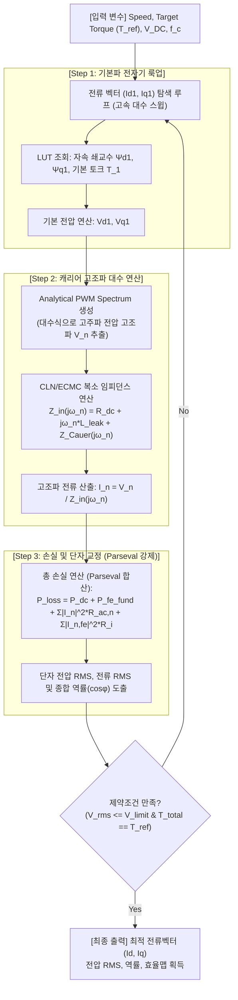

# Steady-State Harmonic Calibration & Sinusoidal Baseline Matching

본 문서는 시간 도메인 과도 시뮬레이션(Time-domain ODE solver)을 돌리지 않으면서, 전력 및 토크 평형(Parseval 정리)을 만족하여 시스템 시뮬레이션 결과와 일치하는 속도/전류 효율맵을 고속으로 산정하기 위한 **정적 하모닉 등가회로 매칭법** 및 그 대조군 검증을 위한 **정현파 기본파 매칭법**을 다룹니다.

---

## 1. 개요 및 검증 전략의 필요성

시간 영역 과도 시뮬레이션은 캐리어 스위칭 전류를 모사할 수 있어 정확하지만, 효율맵 상의 수천 개 운전점을 탐색하기에는 계산 비용이 너무 큽니다. 반면, 전통적인 LUT 기반 정적 효율맵(Forward 계산)은 고주파 전력 및 위상 전이를 반영하지 못해 제어 전류 벡터($i_d, i_q$)의 오차가 생기며, HILS/MILS 등 시스템 시뮬레이션 결과와 효율맵이 불일치하는 문제가 생깁니다.

이 두 모델링의 정합성을 확보하기 위해, **인버터(PWM) 스위칭을 인가하기 전에 이상적인 정현파 입력 기준으로 시스템 시뮬레이션과 등가회로를 먼저 정합하는 1단계 검증**을 수행하고, 이후 **2단계로 PWM 캐리어 주파수 성분을 대수적으로 추가하여 최종 효율맵을 교정하는 설계적 접근**이 매우 중요합니다.

---

## 2. 1단계: 정현파 기본파 매칭 (Sinusoidal Baseline Matching)

PWM을 차단한 이상적인 정현파 전류원(Sinusoidal Current Source) 구동 조건을 대조군(Control Group)으로 설정하여, 기본파 주파수($f_0$) 영역에서 전압/출력/손실의 일관성을 확보합니다.

### 2.1 dq 전압 매칭 수식
삼상 전류 $i_{abc}(t)$가 순수 정현파이면 dq 좌표계에서는 완전한 상수 $I_d, I_q$가 되며, 캐리어 주파수 고조파 성분 $n$은 모두 0이 됩니다. 이 조건에서 등가회로 전압 $V_{d1}, V_{q1}$은 아래의 대수식으로 표현됩니다:

$$V_{d1} = R_{dc} I_{d1} - \omega_e \Psi_{q1}(I_{d1}, I_{q1}) + \text{Re}\{Z_{Cauer}(j\omega_e)\} I_{d1} - \omega_e \text{Im}\{Z_{Cauer}(j\omega_e)\} I_{q1} + V_{fe, d1}$$
$$V_{q1} = R_{dc} I_{q1} + \omega_e \Psi_{d1}(I_{d1}, I_{q1}) + \text{Re}\{Z_{Cauer}(j\omega_e)\} I_{q1} + \omega_e \text{Im}\{Z_{Cauer}(j\omega_e)\} I_{d1} + V_{fe, q1}$$

* **시간 영역 시스템 해석(ECMC)과의 매칭**: 과도 상태가 수렴한 시간 영역 시뮬레이션 상의 평균 전압 $V_{d,avg}, V_{q,avg}$는 위 정적 대수식으로 연산한 $V_{d1}, V_{q1}$과 소수점 수준에서 일치해야 합니다.

### 2.2 파스발 정리를 통한 전력 평형 정합
캐리어 고조파 성분이 없으므로 파스발 정리(Parseval's Theorem)는 오직 기본파 성분만으로 축소되며, 단자 능동 전력(Active Power)은 다음과 같이 보존됩니다:

$$P_{in, avg} = \frac{3}{2}(V_{d1}I_{d1} + V_{q1}I_{q1}) = P_{mech} + P_{cu, 1} + P_{fe, 1}$$

* **기계적 출력**: $P_{mech} = T_{mech} \cdot \omega_m = \frac{3}{2} P_n (\Psi_{d1} I_{q1} - \Psi_{q1} I_{d1}) \omega_m$
* **기본파 동손**: $P_{cu, 1} = \frac{3}{2} I_{rms, 1}^2 \cdot [R_{dc} + \text{Re}\{Z_{Cauer}(j\omega_e)\}]$ (기본파 AC 동손 반영)
* **기본파 철손**: $P_{fe, 1} = \frac{3}{2} \frac{E_{1}^2}{R_{i, 1}(\omega_e)}$ (기본파 철손 저항 $R_{i,1}$에서의 소모)

### 2.3 공간 고조파(Spatial Harmonics)로 인한 맥동의 영향 배제
실제 권선 분포 및 로터 슬롯 형상에 의해 자속 쇄교수에 6차, 12차 등의 공간 고조파가 존재하여 시간 영역 해석의 순시 전압 $v_d(t)$ 및 토크 $T_e(t)$에 리플이 생기더라도, **입력 전류가 완전한 상수($I_d, I_q$)이므로 전압 리플과의 곱의 적분은 0**이 됩니다:

$$\frac{1}{T}\int_0^T V_{d6}\cos(6\theta_e + \alpha_6) \cdot I_d \, dt = 0$$

따라서 공간 고조파 리플의 존재 여부와 상관없이 **평균 능동 전력 레벨에서 100% 매칭이 성립**합니다.

---

## 3. 2단계: 정적 하모닉 등가회로 매칭법 (PWM 캐리어 확장)

정현파 대조군이 매칭된 상태에서, PWM 스위칭 전압의 해석적 푸리에 스펙트럼과 Cauer/철손 임피던스를 대수적으로 결합하여 초고속으로 효율맵의 종합 물리량을 도출합니다.

### 3.1 해석적 PWM 고조파 전압 추출
시간 도메인 인버터 시뮬레이션을 돌리지 않고, 주어진 변조 지수($m_a$)와 스위칭 주파수($f_c$)에 대응하는 인버터 출력 전압의 이중 푸리에 적분 해석식(Double Fourier Integral)을 사용하여 고조파 전압 성분 $V_n$을 대수적으로 생성합니다.
* 주요 성분 대역: $f_c \pm 2f_0, 2f_c \pm f_0$ 등

### 3.2 복소 임피던스 임계 대입을 통한 고조파 전류 계산
CLN/ECMC 회로와 철손 모델의 주파수 대역 복소 임피던스 식 $Z_{input}(j\omega_n)$을 구성하고 각 캐리어 고조파 주파수 $\omega_n$에서의 전류 리플 진폭 $I_n$을 순간 계산합니다:

$$Z_{input}(j\omega_n) = R_{dc} + j\omega_n L_{leak} + Z_{Cauer}(j\omega_n) + \left( j\omega_n L_i \parallel R_i \right)$$

$$I_n = \frac{V_n}{Z_{input}(j\omega_n)}$$

### 3.3 단자 전력 및 역률 강제 교정 (Parseval 정리)
* **총 입력 능동 전력 (Active Power)**:
  $$P_{in} = T_{mech}\cdot\omega_{m} + 3 I_{rms, 1}^2 R_{dc} + P_{iron, 1} + 3 \sum_{n \in carrier} |I_n|^2 R_{ac, n} + 3 \sum_{n \in carrier} |I_{n, fe}|^2 R_i$$
* **종합 전압 및 전류 RMS**:
  $$V_{rms, total} = \sqrt{V_{rms, 1}^2 + \sum_n |V_n|^2}, \quad I_{rms, total} = \sqrt{I_{rms, 1}^2 + \sum_n |I_n|^2}$$
* **종합 역률(Power Factor) 강제 교정**:
  $$\cos\phi_{total} = \frac{P_{in}}{3 \cdot V_{rms, total} \cdot I_{rms, total}}$$

이 관계식을 통해 계산된 $\cos\phi_{total}$과 전압/전류 RMS 크기는 **시간 영역 과도 시뮬레이션(Loop)을 마친 최종 정상상태 단자에서 측정하는 물리량과 정확히 일치**하게 됩니다.

---

## 4. 검증 및 디버깅 가이드라인

1. **정현파 대조군 불일치 시 해결 방안**:
   * 전압 크기($V_{dq}$) 불일치: LUT 자속 맵($\Psi_{d1}, \Psi_{q1}$)의 기하학적 로드 조건 확인 또는 크로스커플링 항 확인.
   * 전력량 불평형: Cauer 회로의 실수 임피던스가 기본파 저항 $R_{ac,1}$로 올바르게 수렴하고 있는지 검증.
2. **PWM 스위칭 시 불일치 시 해결 방안**:
   * 고주파 전류 리플($I_n$) 오차: Cauer 네트워크의 고주파 리액턴스 피팅 오차 또는 누설 인덕턴스($L_{leak}$) 크기 조절.
   * 캐리어 손실 오차: 철손 고주파 바이패스 필터 ($L_i-R_i$) 정수 재검토.
