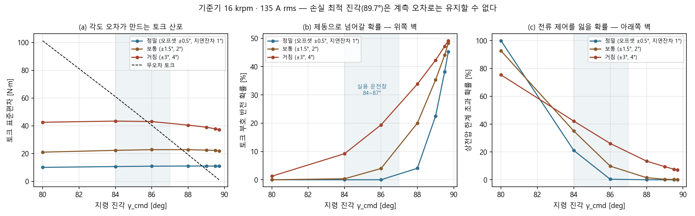
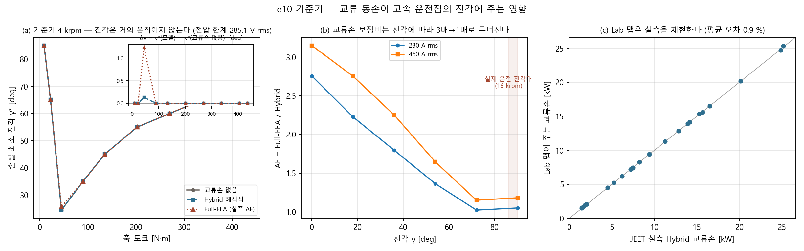

# 고속 저토크 진각 — 결과

인계 문서 `HANDOFF_gamma_highspeed.md` 4절의 결과입니다. 짝 문서는 `loss_torque_convention.html`.
A 절은 PC2 의 1차 결과(R1_0167), B 절은 PC1 회신입니다. 두 PC 가 같은 파일을 쓰므로
**자기 절 안에만 적고 상대 절은 건드리지 않습니다.**

> **상태 (2026-09-17, PC1): B 절 완료.** 결론은 B1, 배경은 B2, 항목별 결과는 B3~B6,
> Motor-CAD 동작 주의 두 가지는 B7 입니다.

---

## A. PC2 1차 결과 — 16 krpm 진각 대 토크 (R1_0167)

PC2, 2026-09-17. Motor-CAD 2026 R1 Lab. 대상 `R1_0167` 슬롯 깊이 고정본.
인계 문서 `HANDOFF_gamma_highspeed.md` 4절 가 항목의 결과입니다.

---

### A1. 스윕 결과

16 krpm, 직류단 720 V, 전류 한계 500 A rms.

| 요구 토크 | 축 토크 | 진각 | 상전류 RMS | Id (peak) | Iq (peak) | 효율 |
|---|---|---|---|---|---|---|
| 1 N·m | 1.0 | **89.60°** | 138.9 A | −196.4 A | 1.38 A | 9.4 % |
| 3 | 3.0 | 89.48° | 139.2 A | −196.8 A | 1.77 A | 23.7 % |
| 6 | 6.0 | 89.32° | 139.6 A | −197.4 A | 2.35 A | 38.2 % |
| 12 | 12.0 | 88.99° | 140.8 A | −199.0 A | 3.52 A | 55.1 % |
| 25 | 25.0 | 88.30° | 144.4 A | −204.2 A | 6.05 A | 71.2 % |
| 50 | 50.0 | 87.21° | 156.4 A | −220.9 A | 10.77 A | 81.6 % |
| 100 이상 | **84.3** | 86.75° | 203.7 A | −287.6 A | 16.34 A | 83.3 % |

요구 토크 100, 200, 350 N·m 는 모두 같은 점으로 포화합니다.
**16 krpm 최대 토크가 84.3 N·m** 이고 그때 진각 86.75° 입니다.
전류가 203.7 A 로 한계 500 A 에 한참 못 미치므로 전압 제한에 걸린 것입니다.

---

### A2. 읽어낼 것

#### A2.1 진각은 전 구간에서 90°에 붙어 있다

가용 토크 전 범위(1 ~ 84.3 N·m)에서 진각이 **86.75° ~ 89.60°** 입니다.
90°에서 3.3° 안쪽입니다. 토크가 커질수록 진각이 내려가는 방향도 예측대로입니다.

#### A2.2 전류는 저토크에서도 줄지 않는다

토크 1 N·m 에서도 138.9 A 가 흐르고 거의 전부 −d축입니다.
이것이 특성전류(약 196 A peak)이고, 16 krpm 에서는 토크와 무관하게 이만큼을 약자속에 써야 합니다.
토크 1 N·m 의 효율이 9.4 % 인 이유가 이것입니다. 축 일량은 1.7 kW 인데 전류는 계속 흐릅니다.

#### A2.3 Full-FEA 배치의 36° 점은 운전점이 아니다 (확정)

16 krpm 최대 토크가 84.3 N·m 인데 손실 격자의 같은 속도·460 A·36° 점은 899 N·m 입니다.
**10배 이상 차이**입니다. 그 격자는 전압 제한을 검사하지 않는 손실 비교용이며
운전 궤적으로 인용하면 안 됩니다. 축 출력으로 보면 격자 점이 1.5 MW, 실제 한계가 141 kW 입니다.

---

### A3. 아직 답하지 못한 것

이 스윕은 Lab 의 기본 손실 설정으로 돌렸습니다.

```
IronLossCalc_Lab    = 3
MagnetLossCalc_Lab  = 3
ACLossMethod_Lab    = 0      <- 값의 의미 미확인
CalcTypeCuLoss_MotorLAB = 0
```

`ACLossMethod_Lab = 0` 이 교류 손실을 끈 것인지, 해석식인지, Full-FEA 맵인지 확인하지 못했습니다.
따라서 **"교류 동손을 고려했을 때 진각이 얼마나 달라지는가"** 라는 원래 질문은 아직 미결입니다.

인계 문서 4절 나 항목이 그것입니다. 같은 토크 점에서 교류 손실 설정 3종
(끔 / 해석식 / Full-FEA 맵)으로 진각을 비교해야 결론이 납니다.
위 표가 그 비교의 기준선입니다.

#### A3.1 모델 해상도 주의

시간을 줄이려 해상도를 낮췄습니다.

```
ModelBuildPoints_Current_Lab = 5   (기본 6)
ModelBuildPoints_Gamma_Lab   = 5   (기본 5)
ModelBuildPoints_Speed_Lab   = 2   (기본 4)
```

속도 점 2개는 거칩니다. 최대 토크 84.3 N·m 와 진각 값이 해상도에 얼마나 민감한지
기본 해상도로 한 번 확인하는 편이 좋습니다. 생성에 26분 걸렸습니다.

---

### A4. 원자료

PC2 `D:\e10\work_lab2\lab2.json`. 스크립트는 `scratchpad/lab2.py`.

---

## B. PC1 회신

PC1(`2020-2-work-B`, `E:\KDH\Overleaf\Thesis_SKKU`), 2026-09-17.

### B0. 먼저 — 대상 기하를 바꿨습니다 (사용자 승인, 09-17)

PC2 가 지목한 `ipmfea/jobs/r2_fullfea/results_pc2_sd/R1_0167/e10_adapt.mot` 은 **레포에 없습니다**
(그 폴더에는 `fullfea.json` 만 커밋돼 있고 `.mot` 은 배치 작업 폴더에만 생겼다가 사라집니다).
PC1 에서 `InjectTask.prepare` 로 재생성은 했고 규약도 맞습니다(슬롯 깊이 13.8357 mm, 도체 6/6,
hausdorff 6e-14 mm, 보어 138.5158 — verify3 범위와 일치). 그런데 **그 기하에는 Lab 모델이 없어
결국 PC2 가 막힌 26 분 빌드를 PC1 이 다시 하게 됩니다.**

그래서 사용자 지시로 **이 로컬에 이미 빌드돼 있는 Lab 모델 6종**으로 진행합니다. 진각 자체가 질문이므로
기하는 e10 계열이면 충분하다는 판단입니다.

| 키 | 파일 | 기하 | AC 손실 맵 | 빌드 |
|---|---|---|---|---|
| `ref_hyb` | `Thesis\e10\refModel\e10Turn6V261.mot` | 기준기 (보어 142.54) | **Hybrid** | 06-29, 460 A rms, 16 krpm |
| `ref_hyb30` | `refModel\e10Turn6V261_Lab30.mot` | 기준기 | Hybrid | 07-30 |
| `sl_hyb30` | `SLFEA\e10Turn6V261SLFEA_Lab30.mot` | SLFEA 2배 축척 (보어 285.08) | **Hybrid** | 07-30 17:56, 920 A |
| `sl_ffea30` | `SLFEA\e10Turn6V261SLFEA_FullFEA_Lab30.mot` | 〃 | **Full FEA (전 슬롯)** | 07-30 22:46, 920 A |
| `sl_hyb48` | `SLFEA\e10Turn6V261SLFEA_Lab48.mot` | 〃 | Hybrid | 07-17 20:36 |
| `sl_ffea48` | `SLFEA\e10Turn6V261SLFEA_FullFEA_LAB.mot` | 〃 | Full FEA (전 슬롯) | 07-16 22:47 |

**같은 기하 위에서 Hybrid 대 Full-FEA 를 맞대볼 수 있는 쌍은 SLFEA(2배 축척) 쪽에만 있습니다.**
진짜 e10 기하에는 Hybrid 빌드만 있습니다. 그래서 인계 문서 4절 (나)의 3종 비교는 SLFEA 쌍으로 하고,
기준기에서는 (AC 끔 / Hybrid 맵 / 사용자비 k_ac) 3종을 봅니다.

원본 `.mot` 과 짝인 `<이름>\Lab\*.mat` 은 작업 폴더로 복사해 열고, **빌드 설정은 건드리지 않습니다**
(`Imax_RMS_MotorLAB`, `SpeedMax_MotorLAB`, `SatModelPoints_MotorLAB` 그대로). 바꾸는 것은 운전점 요구값과
`CalcTypeCuLoss_MotorLAB` / `ControlStrat_MotorLAB` 뿐입니다.

### B0.1 PC2 가 알아야 할 함정 — `get_model_built_lab()` 은 주입 직후에도 True 다

인계 문서 5절은 "포화맵이 이미 있으면 `get_model_built_lab()` 로 확인하고 `build_model_lab()` 생략"이라고
적었는데, **적응형 기하 주입 뒤에는 이 확인이 안전하지 않습니다.**

PC1 에서 `e10Turn6V261.mot`(기준기, Lab 빌드 있음) 에 R1_0167 기하를 주입해 저장한 직후
`get_model_built_lab()` 이 **True** 를 돌려줍니다. 기준 파일의 Lab 모델 플래그와 `Lab\*.mat` 이 그대로
따라오기 때문입니다. 그대로 믿고 운전점을 돌리면 **주입 전 기하의 포화맵**으로 진각을 읽게 됩니다.
빌드 상태는 `LabModel_Saturation_Date` / `LabModel_ACLoss_Date` 와 `LabModel_ACLoss_StatorCurrent_RMS`,
`LabModel_ACLoss_MaxSpeed` 를 함께 보고 판단해야 합니다.

덧붙여 기준 `.mot` 의 `SpeedMax_MotorLAB` 은 **15,000 rpm** 이라 16 krpm 을 덮지 못합니다. 새로 빌드한다면
이 값을 먼저 올려야 합니다(AC 손실 맵의 `LabModel_ACLoss_MaxSpeed` 는 16,000 으로 빌드돼 있습니다).

### B0.2 `ACLossMethod_Lab` 의 뜻 — 확정

Motor-CAD 2026 R1 도움말(`Motor-CAD.chm`: *Copper Loss Model Build*, *BPM AC Winding Loss Model Build*)로
확인했습니다. 교류 손실 처리는 **두 변수의 조합**입니다.

| 변수 | 뜻 | 값 |
|---|---|---|
| `CalcTypeCuLoss_MotorLAB` | Stator Copper Loss 모델 | 0 = DC Only (User) · 1 = DC + AC (User) · 2 = DC + AC (FEA single point) · **3 = DC + AC (FEA Map)** |
| `ACLossMethod_Lab` | 그 FEA Map 을 무엇으로 만드는가 | **0 = Hybrid** · 1 = Full FEA (single slot) · 2 = Full FEA (all slots) |

우리 모델은 전부 `CalcTypeCuLoss_MotorLAB = 3` 이고, `ACLossMethod_Lab` 이 0(Hybrid) 또는 2(Full FEA 전 슬롯)입니다.
빌드된 결과는 `LabModel_ACLoss_Method`(=3, Cu 손실 모델 종류)와 `LabModel_ACLoss_CalculationMethod`(=0 또는 2)에 기록됩니다.
즉 인계 문서가 물은 "끔 / 해석식 / Full-FEA 맵" 3종은

- **끔** = `CalcTypeCuLoss_MotorLAB = 0` (DC 만),
- **해석식** = `3` + `ACLossMethod_Lab = 0` (Hybrid 맵 — 표피·근접 해석식),
- **Full-FEA 맵** = `3` + `ACLossMethod_Lab = 1|2` (도체 솔리드 과도 FEA 맵)

입니다. 앞의 둘은 이미 빌드된 모델에서 **재빌드 없이** 전환됩니다(맵은 빌드돼 있고 쓰느냐 마느냐의 문제).
Full-FEA 맵만 별도 빌드가 필요하고, 그래서 SLFEA 쪽 전용 파일이 따로 있는 것입니다.

또 하나 도움말이 경고하는 것: **커스텀 기하(커스텀 자기 영역 또는 DXF)에서는 Full FEA AC 손실로 Lab 모델을
빌드할 수 없습니다**("the model build will be stopped..."). 적응형 템플릿으로 만드는 R2 설계들이 여기에 걸릴
가능성이 높으니, R1_0167 에서 Full-FEA Lab 맵을 만들 계획이라면 먼저 확인이 필요합니다.

**그래서 A3 절의 표는 이미 "교류 손실 끔" 다리입니다.** PC2 가 적어 둔 설정이
`CalcTypeCuLoss_MotorLAB = 0` 이기 때문입니다. 이 값이 0 이면 `ACLossMethod_Lab` 이 무엇이든 쓰이지 않고
Cu 손실은 직류분만 들어갑니다(도움말 *Copper Loss Model Build*: "DC Only (User)"). PC2 의 89.60° 표는
3종 비교의 기준선이라기보다 **첫 번째 다리**이고, 남은 것은 같은 점에서 `CalcTypeCuLoss_MotorLAB = 3` 으로
바꿔 (Hybrid 맵 / Full-FEA 맵) 두 다리를 읽는 것입니다. 이 전환에는 **재빌드가 필요 없습니다** —
R1_0167 모델의 AC 맵은 `ACLossMethod_Lab = 0`(Hybrid) 으로 이미 함께 빌드돼 있으므로,
PC2 쪽에서도 26 분을 다시 쓰지 않고 `set_variable("CalcTypeCuLoss_MotorLAB", 3)` 한 줄로 두 번째 다리를
바로 얻을 수 있습니다. 세 번째 다리(Full-FEA 맵)만 별도 빌드가 듭니다.

---

### B1. 결론 먼저

**교류 동손을 제대로 넣어도 손실 최소 진각은 1° 안쪽으로만 움직이고, 그 각을 무시했을 때의 손실 손해는
총손실의 0.1 % 이하입니다. 전류맵을 다시 짤 이유가 없습니다.**

| 속도 | 진각 자유도 | Δγ (Hybrid 해석식) | Δγ (Full-FEA) | 교류손 무시의 손실 벌점 |
|---|---|---|---|---|
| 16 krpm | 없음 (전압 한계가 (I, γ)를 묶는다) | 0.00° | 0.00° | 0.000 % |
| 8 krpm | 거의 없음 | 0.00° | 0.00° | 0.000 % |
| 4 krpm | 있음 (γ* 30~60°) | −0.10 ~ −0.19° | **+0.45 ~ +1.02°** | ≤ 0.11 % |

세 속도 모두 정밀 격자(진각 5°, 전류 11점)로 다시 확인했습니다. 8 krpm 은 γ* 70~89° 전 구간에서
Δγ = 0.00°, 벌점 0.000 % 입니다. **자유도가 남는 곳은 4 krpm 뿐이고, 거기서도 1° 안쪽입니다.**

같은 결론이 서로 다른 세 경로에서 나옵니다.

1. **Lab 자체 최적화, 서로 다른 AC 맵으로 빌드된 두 모델** (SLFEA 2배 축척, 같은 기하):
   최대 토크점의 진각이 Hybrid 빌드 87.81° 대 Full-FEA 빌드 87.84° (16 krpm), 85.17° 대 85.13° (8 krpm),
   80.87° 대 80.87° (4 krpm). **차이 ≤ 0.04°.** 30점 빌드 쌍도 88.05° 대 88.07° 로 같습니다.
2. **Lab 맵을 쓰되 최소화는 PC1 이 직접** (전류·진각 격자에서 토크 등고선을 따라 총손실 최소):
   위 표. 같은 절차를 **SLFEA 쌍의 정밀 격자**(진각 5°, 전류 11점)에 그대로 돌리면 4 krpm 의
   모든 토크에서 두 맵의 최소점이 같은 마디에 떨어집니다(Δγ < 격자 1칸). 16 krpm 은 전압 한계 때문에
   γ = 89° 한 마디만 실현 가능해 비교 자체가 성립하지 않습니다.
3. **같은 기하의 실측 Full-FEA 교류손**(JEET 120점)을 Lab Hybrid 맵에 AF 로 얹어 같은 최소화: 위 표의
   Full-FEA 열.

### B2. 왜 움직이지 않는가 — 두 가지 이유

**(i) 고속에서는 전압 한계가 답을 결정합니다.** 16 krpm 무부하 역기전력이 상 1042 V rms 인데
선형 SVPWM 한계는 415.7 V 입니다. 기준기 16 krpm 격자의 상전압(전류·진각 지정, 한계 미적용):

| I \ γ | 60° | 70° | 75° | 80° | 85° | 89° |
|---|---|---|---|---|---|---|
| 138 A | 1086 V | 815 | 659 | **499** | 352 | 278 |
| 230 A | 1316 V | 1020 | 824 | **600** | 359 | 194 |
| 322 A | 1498 V | 1249 | 1077 | **879** | 681 | 573 |

γ = 80° 에서는 **어떤 전류로도** 415.7 V 를 못 맞춥니다. 실현 가능한 (I, γ) 가 좁은 띠로 눌려 있어
손실 모델이 고를 여지가 없습니다. PC2 가 2.1 절에서 계산한 쇄교자속 한계가 그대로 확인됩니다.

**(ii) 실제 운전 진각대에서는 Full-FEA 와 Hybrid 가 거의 같습니다.** 이것이 이번에 새로 나온 것입니다.
같은 기하의 JEET 실측에서 16 krpm 의 교류 초과분은 진각에 따라 **반대 방향으로** 움직입니다.

| γ (16 krpm, 460 A) | 0° | 18° | 36° | 54° | 72° | 90° |
|---|---|---|---|---|---|---|
| Full-FEA [kW] | 40.39 | 38.96 | 37.17 | 33.18 | 28.64 | 29.74 |
| Hybrid [kW] | 12.83 | 14.15 | 16.50 | 20.15 | 24.87 | 25.15 |
| **AF = FEA/Hybrid** | **3.15** | 2.75 | **2.25** | 1.65 | **1.15** | 1.18 |

**Full-FEA 는 진각을 키우면 교류손이 줄고 Hybrid 는 늘어납니다.** 두 모델이 γ 를 미는 방향이 반대라
(표 B1 의 Hybrid 가 −, Full-FEA 가 + 인 이유가 이것입니다), 그 결과 γ = 82~90° 의 실제 운전대에서는
AF 가 1.0 부근으로 수렴합니다. 손실 최소화가 고른 16 krpm 운전점에서 AF 를 다시 읽으면 **0.84 ~ 1.00** 입니다.

> **4 장·7 장에 영향이 있습니다.** 논문이 쓰는 AF ≈ 1.7~1.9 와 "교류 동손이 직류손의 72 %" 는 모두
> **손실 격자의 고정 진각 36°** 에서의 값입니다. 운전 궤적 위(γ 82~90°)에서는 AF ≈ 1.0 입니다.
> 손실 격자의 절대값을 사이클 손실·효율맵으로 옮길 때 이 진각 의존을 빼면 교류손을 과대계상합니다.
> PC2 의 2.2 절("36° 격자를 운전점으로 인용하지 말 것")을 손실 쪽으로 한 걸음 더 민 이야기입니다.

### B3. (가) 토크 스윕 — 6 모델

전 모델에서 PC2 의 관찰이 재현됩니다. 기준기(진짜 e10, 보어 142.54, 460 A rms 상한):

| 요구 토크 (16 krpm) | 0.44 | 1.0 | 2.0 | 17.6 | 44.0 | 83.6 N·m |
|---|---|---|---|---|---|---|
| 진각 | 89.75° | 89.70° | 89.61° | 88.21° | 86.19° | 84.79° |

| 속도 | 최대 토크 | 그때 진각 | 상전류 |
|---|---|---|---|
| 16 krpm | 88.0 N·m | 85.20° | 204.0 A |
| 8 krpm | 196.2 N·m | 81.10° | 233.9 A |
| 4 krpm | 456.9 N·m | 74.80° | 323.8 A |

PC2 의 R1_0167 1 N·m 점(89.60°, 138.9 A)과 기준기의 같은 점(89.70°, 135.6 A)이 **0.1° 안에서 일치**합니다.
기하가 달라도 이 구간은 특성전류가 답을 정하기 때문입니다. 원자료는 모델별 `sweep_<key>.json` (설계당 252 행,
16/8/4 krpm × 저토크 조밀 13~14 점 × 손실처리 3 종 × 제어전략 2 종).

### B4. (다) Lab 맵의 정확도 — 실측과 0.95 %

기준기 16 krpm, JEET 실측 120 점 중 24 점과 Lab 맵이 주는 교류손을 같은 (속도, 전류, 진각)에서 대조했습니다.

| I | γ=0° | 36° | 72° | 90° |
|---|---|---|---|---|
| 230 A (Lab/실측) | 1.000 | 0.998 | 0.999 | 0.996 |
| 460 A (Lab/실측) | 1.000 | 1.001 | 0.994 | 1.008 |

230 A 이상에서 **0.6 % 이내**, 115 A 에서만 2~4 %(평균 0.95 %). Lab 의 FEA 맵 보간은 E-magnetic Hybrid
계산을 그대로 재현합니다. 따라서 위 B1 의 3 번 경로(Lab Hybrid 맵 × 실측 AF)로 Full-FEA 장을 만든 것이
정당합니다. 그림 (c) 참조.

### B5. (라) 무부하 성분 분리 — 끝났습니다

R1_0167 기하(이 항목만 그 기하로 돌렸습니다), 전류 0, 16 krpm, `ProximityLossModel = 3`, 335 s:

| 항목 | 값 | 토크 환산 (ω = 1675.5 rad/s) |
|---|---|---|
| 무부하 도체 와전류손 (Full-FEA) | **4.35 W** | 0.0026 N·m |
| 무부하 고정자 철손 | 1385.8 W | 0.83 N·m |
| 무부하 자석손 | 5.57 W | 0.0033 N·m |

교류 동손 중 제동 성분은 같은 기하 460 A 교류 초과분(30.0 kW)의 **0.015 %** 입니다.
`loss_torque_convention.html` 3 절의 분류가 수치로 확인됩니다 — **교류 동손은 전부 입력측으로 넣고
제동 항에서 빼지 않아도 됩니다.** 반면 무부하 고정자 철손 0.83 N·m 은 제동 항에 유의미하게 들어갑니다.

(같은 실행의 2·3 번 점(230 A Full-FEA, 무부하 Hybrid)은 인스턴스가 3 시간 동안 CPU 0 % 로 응답을 멈춰
해당 PID 만 정리했습니다. 필요한 값은 1 번 점이고, 230 A 점은 PC2 의 `fullfea.csv` 에 이미 있습니다.)

### B6. 실제 제어기의 진각 상한에 대해

"현장에서는 고속 저토크에 80° 이상 넣기 어렵다"는 이야기가 있습니다. 이 기계에서는 **오히려 80° 아래로
갈 수 없습니다**(B2 의 전압표). 그 이야기는 기계가 아니라 제어기 쪽 제약이고, 근거는 각도 민감도입니다.
16 krpm 기준기, dT/dγ [N·m / 전기각 1°]:

| I | γ=70° | 80° | 85° |
|---|---|---|---|
| 138 A | −8.5 | −10.4 | −10.9 |
| 230 A | −14.6 | −20.4 | −22.6 |

- 각도 1° 가 토크 10~20 N·m 입니다. 1 N·m 운전점에서 0.1° 오차가 토크 100 % 오차이고, 89.x° 를 넘기면
  부호가 뒤집혀 제동으로 들어갑니다. 레졸버 오프셋(1~2°), 자석 온도에 따른 λm 드리프트가 그대로 들어옵니다.
- 16 krpm 전기주파수 1066.7 Hz 에서 10 kHz PWM 한 주기가 전기각 38°, 1.5 주기 지연이면 58° 입니다.
  보상해도 잔차가 수 도 남습니다.
- 약자속 심부에서는 전류 PI 가 포화해 실제 전류벡터를 전압 제약이 정합니다. MTPV 리미터도 여유를 두고 겁니다.
- 1 N·m 을 내려고 138 A 를 흘리면 직류 4.3 kW + 교류 2.8 kW + 철손 2.7 kW ≈ 10 kW 가 열입니다(효율 6~13 %).

**따라서 이 문서의 89.7° 는 "손실 최적 설정점"이지 제어기가 실제로 유지하는 각이 아닙니다.** 논문·보고서에
인용할 때 이 단서를 달아야 합니다. 그리고 제어기가 γ 를 80~85° 에서 자르면 운전점은 전압 한계선에 더
붙으므로, B1 의 결론(진각이 안 움직인다)은 약해지는 게 아니라 강화됩니다.

#### B6.1 각도 오차 몬테카를로 — 운전창을 숫자로

위 이야기를 확인하려고, 뽑아 둔 격자 T(I, γ)·V(I, γ) 위에서 지령 진각에 오차를 뿌려 봤습니다
(기준기 16 krpm, 전류 135 A rms 유지, 2만 시행; 오차 = 레졸버 오프셋 균일 ±a + 지연 잔차 정규 σ +
자석 온도에 따른 자속 드리프트). Motor-CAD 를 더 돌리지 않습니다.

오차 **±1.5° + σ2°** (보통 수준):

| γ 지령 | 무오차 토크 | 토크 표준편차 | 부호 반전 | 전압 한계 초과 |
|---|---|---|---|---|
| 80° | 101.3 N·m | ±21.0 (21 %) | 0 % | **92.6 %** |
| 84° | 61.0 | ±22.3 (37 %) | 0.4 % | 35.0 % |
| 86° | 40.3 | ±22.8 (57 %) | 4.0 % | 9.8 % |
| 88° | 19.1 | ±22.8 (117 %) | **20.0 %** | 1.5 % |
| 89.7° (손실 최적) | 1.1 | ±21.8 (1376 %) | **48.3 %** | 0.1 % |

**벽이 양쪽에서 조여옵니다.** 아래쪽은 전압(80° 에서 시행의 93 % 가 한계 초과 → 전류 제어 상실),
위쪽은 토크 정밀도(89.7° 에서 절반이 제동으로 넘어감). 실용 운전창은 **84~87°** 이고,
오차가 거칠면(±3° + σ4°) 그 창도 사라집니다(86° 에서 부호 반전 19 %, 전압 초과 26 %).
계측이 정밀하면(±0.5° + σ1°) 86~89° 로 넓어집니다 — **"80° 벽"은 기계가 아니라 계측·지연 예산의 함수**입니다.



#### B6.2 더 제대로 재현하려면 (Simulink)

PC1 에는 필요한 라이선스가 다 있습니다(`Motor_Control_Blockset`, `Power_System_Blocks`, `Simscape`,
`Powertrain_Blockset`). eMach `tools/SystemSimulationModel/` 에 Lab 맵을 Simulink **Flux-Based PMSM**
블록으로 밀어 넣는 코드(`makeFluxBasedPMSM.m`, `createFluxMaps.m`, `createCurrentTableMCAD.m`)가 이미 있고,
Motor-CAD 설치 폴더에는 `FMU\Ansys_Motor-CAD_Lab_BPM.fmu` 도 있습니다. 단계는 이렇게 봅니다.

| 단계 | 모델 | 재현되는 원인 | 품 |
|---|---|---|---|
| 0 (완료) | 격자 + 오차 몬테카를로 | 각도 오차 → 토크 산포·부호 반전·전압 초과 | 1~2 h |
| 1 | 평균값 dq (Ts 이산, 스위칭 없음) | 1.5 Ts 지연(1067 Hz 에서 58°), 전류 PI 포화·안티와인드업, 약자속 외루프 대역, MTPV 리미터, 레졸버 오프셋, λm 드리프트 | 0.5~1 d |
| 2 | 스위칭 (SPS/Simscape Electrical) | 데드타임 전압 왜곡(깊은 FW 는 변조율 0.46 이라 상대 비중이 크다), 과변조·6-스텝 전이, 리플 | 1~2 d |
| 3 | Lab FMU 연성 | 과도 중 손실(교류 동손 맵 포함)까지 | 선택 |

모델 검증 앵커: λm = 0.22 Vs(16 krpm 역기전력 1042 V rms), 전압 한계 415.7 V, **γ < 80° 는 어떤 전류로도
불가**, 1 N·m 손실 최적점 γ 89.70° · 135.6 A, dT/dγ = −10.4 N·m/°(138 A) · −20.4(230 A),
16 krpm 손실 분해 DC 4.3 + AC 2.8 + 철손 2.7 kW. 이 여섯 개를 못 맞추면 모델이 틀린 것입니다.

### B7. PC2 가 알아야 할 Motor-CAD 동작 두 가지

**(1) `CalcTypeCuLoss_MotorLAB` 은 되돌리면 맵이 다시 안 붙습니다.** 파일을 연 직후의 `3`(FEA Map)은
정상 적용되지만, `0`(DC만)이나 `1`(사용자비)로 바꿨다가 **다시 `3` 으로 되돌리면 교류손이 ~0 으로 나옵니다.**
같은 운전점에서 확인한 값입니다.

| 16 krpm, 44 N·m | γ | Pcu,AC |
|---|---|---|
| 파일 로드 직후 `3` | 86.19° | 3248 W |
| `0`·`1` 을 거친 뒤 다시 `3` | 86.15° | **3.1 W** |

제어전략과는 무관합니다(전략 0·1 모두 같은 증상). **손실 처리를 바꿔 가며 비교할 때는 변형마다
`load_from_file` 로 다시 열어야 합니다.** PC1 의 1 차 스윕에서 전략 1 의 "맵" 다리가 이것 때문에
사실상 교류손 없는 계산이었고, 격자 계산(파일 로드 직후 `3` 한 번만 설정)은 영향이 없습니다.

**(2) `ControlStrat_MotorLAB` 은 0 = 최대토크/암페어, 1 = 최대효율입니다.** 4 krpm·1 N·m 에서
0 번이 전류 최소(0.83 A, γ 0.45°), 1 번이 총손실 최소(3.38 A, γ 76.5°, 철손 226.7 → 219.7 W)입니다.
도움말의 서술 순서(최대효율이 먼저)와 열거값 순서가 다릅니다.

### B8. 산출물

작업 폴더 `D:\KangDH\Thesis\e10\work_lab_pc1\existing\` (PC1):

| 파일 | 내용 |
|---|---|
| `sweep_<key>.json` (6) | 모델별 토크 스윕 252 행 + 속도별 최대 토크 |
| `gammagrid_<key>.json` | 진각 18° 격자 (JEET 격자와 같은 점) |
| `gammagrid_<key>_fine<speed>.json` | 진각 5° · 전류 11 점 정밀 격자 |
| `gamma_curve_ref.csv` | 기준기 손실 최소 진각 (교류손 3 종, 벌점 포함) |
| `gamma_opt_ref16000.csv`, `gamma_opt_ref4000.csv` | 조밀 메시 최소화 결과 |
| `gamma_ac_summary.png` | 아래 그림 (이 폴더에도 같은 파일을 둡니다) |
| `probe_strategy.json` | B7 (1) 재현 실험 |
| `gamma_curve_ref8000.csv`, `gamma_curve_sl4000.csv` | 8 krpm · SLFEA 4 krpm 확인분 |
| `gamma_wall_mc.csv`, `gamma_wall_mc.png` | B6.1 각도 오차 몬테카를로 |

스크립트는 PC1 `scratchpad/` 의 `lab_existing.py`(스윕), `lab_gammagrid.py`(격자),
`gamma_opt.py` · `gamma_opt_ref.py` · `gamma_curve.py`(최소화), `make_fig.py`.
정리되면 `ipmfea` 패키지로 옮깁니다.



### B9. 공용 PC 관리

PC1 에는 사용자가 9/16 에 띄운 Motor-CAD 창(PID 37116)이 살아 있습니다. 이미지 이름으로 일괄 종료하지 않고,
`Get-CimInstance Win32_Process -Filter "Name='MotorCAD.exe'"` 의 `ParentProcessId` 로 드라이버와 짝지어
개별 PID 만 다뤘습니다. PC1 이 띄운 PID 는 `work_lab_pc1\pids.txt` 에 기록합니다.
동시 기동이 4 개를 넘으면 `Failed to find Motor-CAD port` 로 떨어지므로(실측) 기동 재시도 3 회 + 순차 실행을
규약으로 둡니다.
